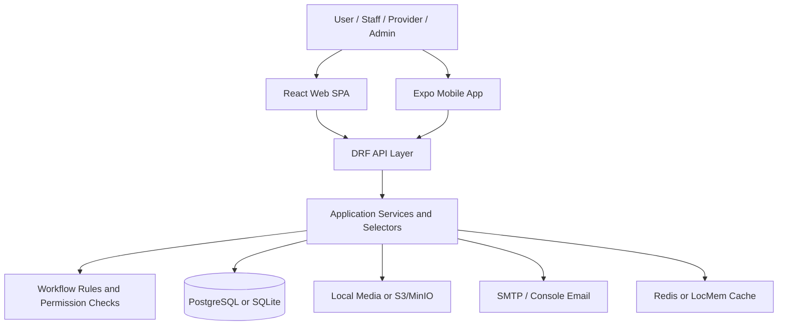
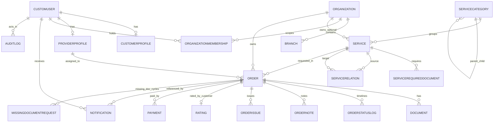
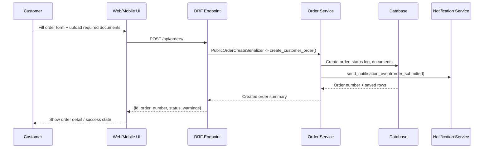
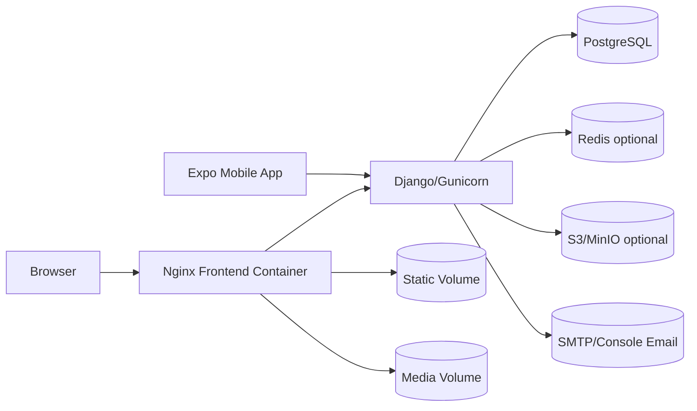

# Full Project Architecture

## 1. Executive Summary

Khalisni is a multi-surface service-order management platform for government and administrative requests. The repository contains a Django 5 + Django REST Framework backend, a React + Vite web portal, and an Expo / React Native mobile app. The system supports public service discovery, authenticated customer order creation, document collection, internal employee review, provider execution, final-document delivery, payments, notifications, tenant-aware organization scoping, public-site CMS, and contextual help guides. Evidence: `README.md`, `backend/config/settings.py`, `backend/config/urls.py`, `frontend/src/routes/AppRoutes.jsx`, `mobile/src/navigation/RootNavigator.tsx`.

The codebase implements a hybrid B2B2C model. Orders belong to customers, are scoped to partner organizations and optional branches, may be assigned to provider organizations, and are governed by explicit workflow transition rules. The platform also exposes admin CRUD surfaces for catalog, users, providers, content, notifications, reports, and audit logs. Evidence: `backend/organizations/models.py`, `backend/orders/models.py`, `backend/workflow/rules.py`, `backend/config/permissions.py`.

## 2. System Purpose

The system centralizes the full lifecycle of service requests:

- Public users browse service categories and service details, then move into authenticated order creation. Evidence: `frontend/src/pages/public/ServicesPage.jsx`, `frontend/src/pages/public/ServiceDetailsPage.jsx`, `backend/services/views.py`.
- Customers submit service orders with required documents, track status, respond to missing-document requests, and download final outputs. Evidence: `backend/orders/views.py`, `backend/orders/services.py`, `frontend/src/pages/customer/*.jsx`, `mobile/src/features/client/screens/*.tsx`.
- Internal staff review orders, verify documents, request missing items, assign providers, control workflow transitions, and monitor reports. Evidence: `backend/orders/services.py`, `backend/documents/views.py`, `backend/reports/views.py`, `frontend/src/pages/employee/*.jsx`.
- Providers receive assigned work, update execution status, add internal notes, and upload final result documents. Evidence: `backend/providers/views.py`, `backend/orders/services.py`, `frontend/src/pages/provider/*.jsx`.
- Admins manage users, organizations, services, prices, notification templates, payments, public content, and audit data. Evidence: `backend/accounts/views.py`, `backend/organizations/views.py`, `backend/services/views.py`, `backend/notifications/views.py`, `backend/payment/views.py`, `backend/public_site/views.py`.

## 3. Technology Stack

| Layer | Technology | Evidence/File | Notes |
| ----- | ---------- | ------------- | ----- |
| Backend framework | Django 5 | `backend/requirements.txt`, `backend/config/settings.py` | Main application framework. |
| API layer | Django REST Framework | `backend/requirements.txt`, `backend/config/settings.py` | Class-based APIs, viewsets, pagination, throttling. |
| Auth | Simple JWT | `backend/requirements.txt`, `backend/config/settings.py`, `backend/accounts/views.py` | Access token lifetime 8h, refresh 7d. |
| Auth fallback | SessionAuthentication | `backend/config/settings.py` | Still enabled in DRF defaults. |
| DB engine | PostgreSQL 16 / SQLite fallback | `docker-compose.yml`, `backend/config/settings.py` | PostgreSQL when `POSTGRES_DB` exists; otherwise SQLite. |
| Web frontend | React 19 + Vite 8 | `frontend/package.json`, `frontend/vite.config.js` | Browser SPA with lazy-loaded route modules. |
| Web UI | Tailwind CSS 3 | `frontend/package.json`, `frontend/tailwind.config.js` | Arabic-first RTL styling with Cairo font. |
| Web routing | React Router DOM 7 | `frontend/package.json`, `frontend/src/routes/AppRoutes.jsx` | Public and role-protected routes. |
| Web forms | React Hook Form | `frontend/package.json` | Used on form-heavy pages. |
| Web HTTP client | Axios | `frontend/package.json`, `frontend/src/api/client.js` | JWT refresh interceptor and error normalization. |
| Mobile frontend | Expo + React Native | `mobile/package.json`, `mobile/app.json` | Single codebase for Android/iOS/web preview. |
| Mobile state | Zustand | `mobile/package.json`, `mobile/src/state/authStore.ts` | Stores auth session and normalized role. |
| Mobile data fetching | TanStack React Query | `mobile/package.json`, `mobile/src/services/queryClient.ts` | Screen-level queries and mutations. |
| Mobile secure storage | Expo Secure Store | `mobile/package.json`, `mobile/src/auth/authStorage.ts` | Persists session locally. |
| Reverse proxy | Nginx | `frontend/Dockerfile`, `frontend/nginx.conf` | Serves SPA, proxies `/api/`, serves shared static/media volumes. |
| App server | Gunicorn | `backend/requirements.txt`, `backend/entrypoint.sh` | Starts Django WSGI on port 8000. |
| Containers | Docker Compose | `docker-compose.yml`, `docker-compose.override.yml` | Local and server deployment stack. |
| Static/media serving | WhiteNoise + Nginx | `backend/config/settings.py`, `frontend/nginx.conf` | WhiteNoise for static storage, Nginx for served files in Docker. |
| Object storage | `django-storages` + `boto3` | `backend/requirements.txt`, `backend/config/settings.py` | Optional S3/MinIO backend for media. |
| Cache | Redis optional / LocMem fallback | `backend/config/settings.py`, `.env.example` | No queue worker found in current repository. |
| Email | Django email backend | `backend/config/settings.py`, `backend/accounts/password_reset.py` | Password reset and password-change notices. |
| CI/CD | GitHub Actions | `.github/workflows/ci.yml` | Backend checks/tests and frontend lint/tests. |
| Mobile delivery | Expo EAS | `mobile/eas.json`, `mobile/README.md` | Preview and production mobile builds. |

## 4. Repository Structure

Cleaned project tree:

```text
.
+-- .github/
|   `-- workflows/ci.yml
+-- backend/
|   +-- config/
|   +-- core/
|   +-- accounts/
|   +-- organizations/
|   +-- services/
|   +-- orders/
|   +-- documents/
|   +-- workflow/
|   +-- providers/
|   +-- payment/
|   +-- notifications/
|   +-- reports/
|   +-- audit/
|   +-- public_site/
|   +-- help_guides/
|   +-- manage.py
|   +-- entrypoint.sh
|   `-- Dockerfile
+-- frontend/
|   +-- public/
|   +-- src/
|   |   +-- api/
|   |   +-- components/
|   |   +-- context/
|   |   +-- layouts/
|   |   +-- pages/
|   |   +-- routes/
|   |   +-- hooks/
|   |   +-- help/
|   |   +-- locales/
|   |   `-- utils/
|   +-- Dockerfile
|   `-- nginx.conf
+-- mobile/
|   +-- src/
|   |   +-- api/
|   |   +-- auth/
|   |   +-- components/
|   |   +-- config/
|   |   +-- constants/
|   |   +-- features/
|   |   +-- navigation/
|   |   +-- permissions/
|   |   +-- screens/
|   |   +-- services/
|   |   +-- state/
|   |   +-- theme/
|   |   +-- types/
|   |   `-- utils/
|   +-- App.tsx
|   +-- app.json
|   `-- eas.json
+-- docs/
|   +-- mobile/
|   +-- qa/
|   +-- fixes/
|   +-- system_review/
|   +-- final_review/
|   +-- API_SPEC.md
|   +-- DATABASE_SCHEMA.md
|   +-- DEPLOYMENT.md
|   +-- PRD.md
|   `-- SRS.md
+-- scripts/
+-- docker-compose.yml
+-- docker-compose.override.yml
`-- README.md
```

Major folder responsibilities:

- `backend/config/`: Django settings, URL wiring, WSGI/ASGI bootstrap, permission helpers.
- `backend/core/`: shared enums, delete guard, serializer mixins, management commands.
- `backend/accounts/`: authentication, user CRUD, role/group sync, password reset, system settings.
- `backend/organizations/`: tenant organizations, branches, memberships, branding, partner-scoped catalog.
- `backend/services/`: service catalog, categories, prerequisites/relations, required documents, provider assignments.
- `backend/orders/`: order lifecycle, status logs, notes, ratings, missing-document cycles, workflow APIs.
- `backend/documents/`: upload, verification, secure download, soft deletion.
- `backend/workflow/`: canonical transition rules and transition authorization helpers.
- `backend/providers/`: provider profiles, provider admin actions, provider execution APIs.
- `backend/payment/`: payment records, invoices, commission rules, payouts, payment status workflow.
- `backend/notifications/`: notification center, templates, event-driven notification dispatch.
- `backend/reports/`: computed dashboards and operational summaries; `backend/reports/models.py` is a placeholder. Evidence: `backend/reports/models.py`.
- `backend/audit/`: audit log storage and admin query APIs.
- `backend/public_site/`: public homepage CMS, theme, advertisements, missing-service requests.
- `backend/help_guides/`: contextual/manual help content and admin authoring APIs.
- `frontend/src/pages/`: route-level web screens by role.
- `frontend/src/api/`: web API adapters plus `frontend/src/api/services.js` mock-capable facade used by pages.
- `mobile/src/features/`: role-oriented mobile screens.
- `docs/`: product, QA, deployment, audit, and mobile planning documents.

## 5. High-Level Architecture

System layers:

- Frontend layer:
  Web SPA in `frontend/` and mobile app in `mobile/`. Both authenticate with JWT and call the same `/api` backend.
- API layer:
  DRF APIViews, generic views, and viewsets exposed from `backend/config/urls.py`.
- Backend/application layer:
  Module-specific views delegate to services and selectors. Workflow-critical logic is centralized in `orders/services.py`, `documents/services.py`, `payment/services.py`, and `notifications/services.py`.
- Domain/business logic layer:
  Models enforce integrity with `clean()` and constraints; workflow rules live in `backend/workflow/rules.py`; permission and tenant scope rules live in `backend/config/permissions.py` and `backend/organizations/selectors.py`.
- Database layer:
  PostgreSQL in Docker deployments, SQLite fallback outside Docker. Data model spans users, organizations, services, orders, documents, payments, notifications, public-site content, and help guides.
- External integration layer:
  SMTP/console email, optional Redis cache, optional S3/MinIO media storage, GitHub Actions CI, Expo EAS builds.
- Deployment/runtime layer:
  Docker Compose runs PostgreSQL, Django/Gunicorn, and Nginx-serving frontend. Backend startup performs migrations, static collection, role sync, optional admin creation, and optional seed data.



## 6. Backend Architecture

Backend entry points:

- `backend/manage.py`: local Django management entry point.
- `backend/config/urls.py`: main URL composition and `/api/health/`.
- `backend/entrypoint.sh`: waits for DB, runs `migrate`, `collectstatic`, `setup_roles`, `create_admin`, optional `seed_initial_data`, then starts Gunicorn.
- `backend/config/settings.py`: application registration, DB, auth, storage, cache, throttling, and upload/email settings.

Main backend modules:

| Module | Main Files | Responsibility |
| ----- | ---------- | -------------- |
| `accounts` | `models.py`, `views.py`, `serializers.py`, `password_reset.py`, `role_groups.py` | User model, JWT login payload, admin user CRUD, delete-guard settings, password reset flow. |
| `organizations` | `models.py`, `views.py`, `selectors.py`, `services.py` | Multi-tenant structure, memberships, scoping, partner onboarding, branding, partner catalog config. |
| `services` | `models.py`, `views.py`, `serializers.py`, `selectors.py`, `order_validation.py` | Service catalog, category hierarchy, prerequisites, document rules, provider-service assignments. |
| `orders` | `models.py`, `views.py`, `serializers.py`, `services.py`, `selectors.py`, `allowed_actions.py` | Order lifecycle, customer/admin/provider order APIs, workflow actions, order visibility. |
| `documents` | `models.py`, `views.py`, `serializers.py`, `services.py`, `selectors.py` | Secure file handling, verification, download token flow, provider/customer visibility rules. |
| `workflow` | `rules.py`, `services.py`, `transition_permissions.py` | Canonical status graph and actor/status authorization. |
| `providers` | `models.py`, `views.py`, `serializers.py` | Provider profiles, provider admin actions, provider work dashboard. |
| `payment` | `models.py`, `views.py`, `services.py`, `serializers.py` | Payment creation, admin payment updates, invoices, commission/payout models. |
| `notifications` | `models.py`, `views.py`, `services.py`, `event_map.py`, `utils.py` | Notification log, template rendering, workflow event dispatch. |
| `reports` | `views.py` | Computed dashboards and reports; no persistent report domain objects found. |
| `audit` | `models.py`, `views.py`, `utils.py` | Central audit trail creation and admin browsing. |
| `public_site` | `models.py`, `views.py`, `serializers.py`, `services.py` | Homepage theme/content CMS, advertisements, missing-service request intake. |
| `help_guides` | `models.py`, `views.py`, `serializers.py`, `selectors.py` | Contextual manual/help registry with fallback-generated guidance. |

Routing system:

- Root includes each app URL module under `/api/`. Evidence: `backend/config/urls.py`.
- Most admin CRUD surfaces are `DefaultRouter` viewsets. Evidence: `backend/accounts/urls.py`, `backend/services/urls.py`, `backend/orders/urls.py`, `backend/providers/urls.py`, `backend/help_guides/urls.py`.
- Workflow actions that must remain safe are exposed as dedicated endpoints, not raw model writes. Evidence: `backend/orders/views.py`, `backend/orders/serializers.py`.

Controllers/views:

- Public/auth endpoints mostly use `APIView` or generic create/update views.
- Admin and catalog endpoints use `ModelViewSet` with delete-guard mixins and audit logging.
- Provider and employee operational actions are explicit APIViews with module services behind them.

Services/business logic:

- `backend/orders/services.py` is the main orchestration layer for order creation, review, assignment, missing-doc cycles, provider work, completion, cancellation, rejection, and reopen/archive.
- `backend/documents/services.py` normalizes document creation, verification, rejection, and permission checks.
- `backend/notifications/services.py` converts workflow events into `Notification` rows using template lookup and dedupe keys.
- `backend/payment/services.py` creates payment rows and emits payment-status notifications.
- `backend/organizations/services.py` resolves order organization and partner onboarding.

Models/entities:

- Core identity: `CustomUser`, `CustomerProfile`, `PasswordResetToken`, `SystemSetting`.
- Tenant scope: `Organization`, `Branch`, `OrganizationMembership`, `OrganizationBranding`, `PartnerServiceConfig`.
- Catalog: `ServiceCategory`, `Service`, `ServiceRelation`, `ServiceRequiredDocument`, `ServiceProviderAssignment`, `Address`.
- Workflow: `Order`, `OrderStatusLog`, `OrderNote`, `OrderAssignmentHistory`, `OrderIssue`, `Rating`, `MissingDocumentRequest`.
- Execution/supporting: `Document`, `ProviderProfile`, `Payment`, `Invoice`, `CommissionRule`, `ProviderPayout`, `Notification`, `NotificationTemplate`, `AuditLog`, `SiteTheme`, `PublicPageContent`, `Advertisement`, `public_site.MissingServiceRequest`, help-guide models.

Serializers/schemas/forms:

- DRF serializers define both transport contracts and some business validation. Examples: `PublicOrderCreateSerializer`, `AdminStatusUpdateSerializer`, `DocumentUploadSerializer`, `AdminUserSerializer`, `AdminRequiredDocumentRuleSerializer`.
- File-upload endpoints use multipart parsers and serializer-based upload validation against settings-backed extension/MIME/size lists.

Middleware:

- Standard Django middleware plus optional `WhiteNoise` and optional `CorsMiddleware`. Evidence: `backend/config/settings.py`.
- No custom request/response middleware found in current repository.

Permissions:

- Central permission classes live in `backend/config/permissions.py`.
- Access control combines:
  1. `CustomUser.role`
  2. Django groups and direct permissions
  3. `OrganizationMembership.role`
  4. Order/document/provider ownership checks
- This hybrid model is powerful but complex; see Section 23.

Background jobs:

- Not found in current repository.
- The system stores retry/scanning metadata (`Notification.next_retry_at`, `Document.scan_status`) but no worker, queue consumer, Celery config, cron job, or asynchronous job runner exists in code.

Utility modules:

- `backend/core/delete_guard.py`: password-confirmed admin delete/deactivate gate.
- `backend/audit/utils.py`: normalized audit event creation.
- `backend/services/service_relations.py`: circular prerequisite detection.
- `backend/services/service_categories.py`: circular category detection.

## 7. Frontend Architecture

Web frontend entry points:

- `frontend/src/main.jsx`: mounts the SPA, unregisters any existing service workers/caches.
- `frontend/src/App.jsx`: wraps routes in `ToastProvider`, `LanguageProvider`, `AuthProvider`, `HelpGuideProvider`.
- `frontend/src/routes/AppRoutes.jsx`: all public and protected routes.

Web route architecture by role:

| Surface | Key Route Files | Notes |
| ----- | --------------- | ----- |
| Public website | `frontend/src/layouts/PublicLayout.jsx`, `frontend/src/pages/public/*.jsx` | Marketing pages, service catalog, login/register, track order. |
| Customer portal | `frontend/src/pages/customer/*.jsx` | Order creation, list, detail, missing-doc response, profile. |
| Employee portal | `frontend/src/pages/employee/*.jsx` | Review queue, document verification, reports. |
| Support/admin shared | `frontend/src/pages/shared/*.jsx` | Missing-service requests, category management, service relations, manual launch. |
| Admin portal | `frontend/src/pages/admin/*.jsx` | Orders, rules, CMS, services, providers, payments, audit, help guides. |
| Provider portal | `frontend/src/pages/provider/*.jsx` | Assigned orders, work status, final-document upload. |

Web client architecture:

- `frontend/src/context/AuthContext.jsx`: bootstraps current user via `/auth/me/`, persists tokens via `frontend/src/api/client.js`, logs out by blacklisting refresh token.
- `frontend/src/api/client.js`: Axios client with local/session storage modes, token refresh interceptor, normalized API errors, and secure admin delete helper.
- `frontend/src/api/services.js`: higher-level facade that wraps per-domain API modules and injects test-mode mock data when `import.meta.env.MODE === 'test'`.
- `frontend/src/context/PublicSiteContext.jsx`: loads theme/homepage content and injects CSS variables.
- `frontend/src/context/HelpGuideContext.jsx`: loads contextual manual data keyed by route and workflow status.
- `frontend/src/context/LanguageContext.jsx`: Arabic/English locale, RTL/LTR handling, translation lookup.

Mobile frontend entry points:

- `mobile/App.tsx`: sets Expo font/theme providers, React Query provider, and `AuthProvider`.
- `mobile/src/navigation/RootNavigator.tsx`: switches among auth, client, employee, provider, and admin navigators.
- `mobile/src/auth/AuthProvider.tsx`: restores session from secure storage, calls `/auth/me/`, and applies access tokens to the shared Axios client.

Mobile architecture notes:

- API calls live in `mobile/src/api/*.ts`.
- Session state lives in Zustand (`mobile/src/state/authStore.ts`).
- Roles are normalized so backend `customer` becomes mobile `client`, and backend `support` becomes mobile `employee`. Evidence: `mobile/src/constants/roles.ts`.
- Data fetching uses React Query per screen. Evidence: `mobile/src/features/**/screens/*.tsx`.

State management:

- Web: mostly React context + local component state; no Redux or Zustand found in web app.
- Mobile: Zustand for auth/session, React Query for server state.

Form handling:

- Web uses native React state and React Hook Form depending on page.
- Mobile uses component state plus `FormData` construction for file uploads.

Authentication handling:

- Web stores tokens in either `sessionStorage` or `localStorage` depending on "remember me". Evidence: `frontend/src/api/client.js`, `frontend/src/context/AuthContext.jsx`.
- Mobile stores session via secure storage and retries requests after refresh token exchange. Evidence: `mobile/src/api/client.ts`, `mobile/src/auth/authStorage.ts`.

Relationship between screens and backend APIs:

| UI area | Web files | Mobile files | Main APIs |
| ------ | --------- | ------------ | --------- |
| Public service browsing | `frontend/src/pages/public/HomePage.jsx`, `ServicesPage.jsx`, `ServiceDetailsPage.jsx` | `mobile/src/features/client/screens/ServiceListScreen.tsx`, `ServiceDetailScreen.tsx` | `/services/`, `/services/categories/`, `/services/{slug}/`, `/public-site/*` |
| Customer order creation | `frontend/src/pages/customer/CustomerCreateOrderPage.jsx` | `mobile/src/features/client/screens/CreateOrderScreen.tsx` | `POST /orders/`, `GET /services/{slug}/` |
| Customer order management | `frontend/src/pages/customer/*.jsx` | `mobile/src/features/client/screens/*.tsx` | `/customer/orders/*`, `/documents/*` |
| Employee operations | `frontend/src/pages/employee/*.jsx` | `mobile/src/features/employee/screens/*.tsx` | `/admin/orders/*`, `/staff/documents/*`, `/employee/*`, `/admin/providers/` |
| Provider execution | `frontend/src/pages/provider/*.jsx` | `mobile/src/features/provider/screens/*.tsx` | `/provider/dashboard/`, `/provider/orders/*` |
| Admin management | `frontend/src/pages/admin/*.jsx` | `mobile/src/features/admin/screens/*.tsx` | `/admin/*`, `/help/admin/*`, `/public-site/*`, `/reports/*` |

## 8. API Architecture

API style:

- REST over JSON/multipart.
- No GraphQL, WebSocket, RPC, or SSE endpoints found in current repository.

Complete API table:

| Method | Endpoint | Handler/File | Purpose | Auth Required | Request | Response | Models Used | Frontend Caller |
| ------ | -------- | ------------ | ------- | ------------- | ------- | -------- | ----------- | --------------- |
| `GET` | `/api/health/` | `healthcheck` in `backend/config/urls.py` | Container/app health | No | None | `{status:"ok"}` | None | Not found in current repository |
| `POST` | `/api/auth/register/` | `RegisterAPIView` in `backend/accounts/views.py` | Customer registration | No | `full_name`, `phone`, `email`, `password`, `national_id` | User payload | `CustomUser` | Web: `frontend/src/pages/public/RegisterPage.jsx` |
| `POST` | `/api/auth/login/` | `LoginAPIView` in `backend/accounts/views.py` | JWT login | No | `email`, `password` | `{access, refresh, user}` | `CustomUser` | Web: `LoginPage.jsx`; Mobile: `mobile/src/screens/auth/LoginScreen.tsx` |
| `POST` | `/api/auth/logout/` | `LogoutAPIView` | Refresh token blacklist/logout audit | Yes | `refresh` | `204` | `CustomUser` | Web `AuthContext`; Mobile `AuthProvider` |
| `POST` | `/api/auth/forgot-password/` | `ForgotPasswordAPIView` | Customer password-reset request | No | `email` | Generic success message | `CustomUser`, `PasswordResetToken` | Web `ForgotPasswordPage.jsx`; Mobile `ForgotPasswordScreen.tsx` |
| `POST` | `/api/auth/reset-password/{token}/` | `ResetPasswordAPIView` | Reset password using emailed token | No | `new_password`, `confirm_new_password` | Success message | `PasswordResetToken`, `CustomUser` | Web `ResetPasswordPage.jsx` |
| `POST` | `/api/auth/token/refresh/` | `TokenRefreshView` from SimpleJWT | Refresh access token | No | `refresh` | `{access}` | JWT blacklist app | Web/mobile Axios interceptors |
| `GET` | `/api/auth/me/` | `MeAPIView` | Current user session bootstrap | Yes | None | `UserSerializer` payload | `CustomUser`, `OrganizationMembership` | Web `AuthContext`; Mobile `AuthProvider` |
| `PATCH` | `/api/customer/profile/` | `CustomerProfileAPIView` | Customer self-profile update | Yes, customer | `full_name`, `phone`, `email`, `national_id` | Updated user payload | `CustomUser` | Web `ProfilePage.jsx`; Mobile `ProfileScreen.tsx` |
| `GET` | `/api/admin/available-permissions/` | `AvailablePermissionsAPIView` | Permission list for admin UI | Yes, user-role admin permission | None | Grouped permission dictionary | `Permission` | Web `AdminUsersRolesPage.jsx`, `HelpGuideManagementPage.jsx` |
| `GET`,`PUT` | `/api/admin/delete-guard/` | `DeleteGuardSettingAPIView` | Read/update extra delete password | Yes, admin | PUT requires `delete_password`, `confirm_delete_password` | Delete-guard config | `SystemSetting` | Web `AdminCmsPage.jsx`, `AdminRuleManagementPage.jsx` |
| `GET`,`POST` | `/api/admin/users/` | `AdminUserViewSet` | List/create users | Yes, `CanManageUserRoles` | Create accepts user fields, optional org/branch/membership, password | Paginated list or created user | `CustomUser`, `OrganizationMembership` | Web `AdminUsersRolesPage.jsx`; Mobile admin user surfaces |
| `GET`,`PUT`,`PATCH`,`DELETE` | `/api/admin/users/{id}/` | `AdminUserViewSet` | Retrieve/update/deactivate users | Yes | Partial user fields; DELETE requires delete password | User payload or `204` | `CustomUser` | Web `AdminUsersRolesPage.jsx` |
| `GET`,`PATCH` | `/api/admin/users/{id}/permissions/` | `AdminUserViewSet.user_permissions` | Get/set direct permissions | Yes | PATCH `{permissions:[app.codename]}` | Permission list | `CustomUser`, `Permission` | Web `AdminUsersRolesPage.jsx`; Mobile `users.api.ts` |
| `GET`,`POST` | `/api/admin/system-settings/` | `SystemSettingViewSet` | List/create safe rule-screen settings | Yes | Safe keys only (`site.homepage`, `site.contact`) | Safe setting payload | `SystemSetting` | Web `AdminCmsPage.jsx`, `AdminRuleManagementPage.jsx`; Mobile `admin.api.ts` |
| `GET`,`PUT`,`PATCH` | `/api/admin/system-settings/{id}/` | `SystemSettingViewSet` | Retrieve/update safe setting | Yes | Safe setting fields | Safe setting payload | `SystemSetting` | Web `AdminCmsPage.jsx`, `AdminRuleManagementPage.jsx` |
| `GET`,`POST`,`PUT`,`PATCH`,`DELETE` | `/api/admin/customer-profiles/`, `/api/admin/customer-profiles/{id}/` | `CustomerProfileAdminViewSet` | Customer profile admin CRUD | Yes | Standard model fields | Model payload | `CustomerProfile` | Not found in current repository |
| `GET`,`POST`,`PUT`,`PATCH`,`DELETE` | `/api/organizations/`, `/api/organizations/{id}/` | `OrganizationViewSet` | Tenant organization CRUD/soft deactivate | Yes | Organization fields | Organization payload | `Organization` | Not found in current repository |
| `GET`,`POST`,`PUT`,`PATCH`,`DELETE` | `/api/branches/`, `/api/branches/{id}/` | `BranchViewSet` | Branch CRUD/soft deactivate | Yes | Branch fields | Branch payload | `Branch` | Not found in current repository |
| `GET`,`POST`,`PUT`,`PATCH`,`DELETE` | `/api/organization-memberships/`, `/api/organization-memberships/{id}/` | `OrganizationMembershipViewSet` | Membership CRUD/soft deactivate | Yes | Membership fields | Membership payload | `OrganizationMembership` | Not found in current repository |
| `GET`,`POST`,`PUT`,`PATCH`,`DELETE` | `/api/organization-branding/`, `/api/organization-branding/{id}/` | `OrganizationBrandingViewSet` | Organization branding CRUD | Yes | Branding fields/files | Branding payload | `OrganizationBranding` | Not found in current repository |
| `GET`,`POST`,`PUT`,`PATCH`,`DELETE` | `/api/partner-service-configs/`, `/api/partner-service-configs/{id}/` | `PartnerServiceConfigViewSet` | Partner-specific service pricing/visibility | Yes | Service config fields | Partner config payload | `PartnerServiceConfig` | Not found in current repository |
| `POST` | `/api/platform/partner-onboarding/` | `PartnerOnboardingAPIView` | Create partner org + owner + main branch | Yes, platform admin | Organization and owner/branch fields | Organization payload | `Organization`, `Branch`, `OrganizationMembership` | Not found in current repository |
| `GET` | `/api/me/memberships/` | `MyMembershipsAPIView` | Current memberships | Yes | None | Membership list | `OrganizationMembership` | Not found in current repository |
| `GET` | `/api/services/` | `ServiceListAPIView` | Public/customer-visible services | No | Optional `organization`, `category`, `category_id`, `featured`, search | Service list | `Service`, `PartnerServiceConfig`, `ServiceCategory` | Web public pages and customer order flow; Mobile client dashboard/list/create |
| `GET` | `/api/services/categories/` | `ServiceCategoryListAPIView` | Public/customer-visible categories | No | Optional `organization`, `parent` | Category list | `ServiceCategory` | Web public pages; Mobile service list |
| `GET` | `/api/services/{slug}/` | `ServiceDetailAPIView` | Service detail, required docs, relations | No | URL slug | Detailed service payload | `Service`, `ServiceRequiredDocument`, `ServiceRelation` | Web `ServiceDetailsPage.jsx`; Mobile `ServiceDetailScreen.tsx`, `CreateOrderScreen.tsx` |
| `GET`,`POST`,`PUT`,`PATCH`,`DELETE` | `/api/admin/services/`, `/api/admin/services/{id}/` | `ServiceAdminViewSet` | Service CRUD / soft disable | Yes | Service fields | Admin service payload | `Service` | Web `ServicesManagementPage.jsx`, `AdminRuleManagementPage.jsx`; Mobile `ManageServicesScreen.tsx`, `ManagePricesScreen.tsx` |
| `GET`,`POST`,`PUT`,`PATCH`,`DELETE` | `/api/admin/categories/`, `/api/admin/categories/{id}/` | `CategoryAdminViewSet` | Category CRUD / soft disable | Yes | Category fields | Admin category payload | `ServiceCategory` | Web `ServiceCategoryManagementPage.jsx`, `AdminRuleManagementPage.jsx` |
| `POST` | `/api/admin/categories/reorder/` | `CategoryAdminViewSet.reorder` | Reorder visible categories | Yes | `{items:[{id,sort_order}]}` | Detail message | `ServiceCategory` | Web `ServiceCategoryManagementPage.jsx` |
| `GET`,`POST`,`PUT`,`PATCH`,`DELETE` | `/api/admin/service-documents/`, `/api/admin/service-documents/{id}/` | `RequiredDocumentAdminViewSet` | Required-document rule CRUD / soft disable | Yes | Document-rule fields | Rule payload | `ServiceRequiredDocument` | Web `AdminRuleManagementPage.jsx` |
| `GET`,`POST`,`PUT`,`PATCH`,`DELETE` | `/api/admin/service-relations/`, `/api/admin/service-relations/{id}/` | `ServiceRelationAdminViewSet` | Service relation CRUD / soft deactivate | Yes | Relation fields | Relation payload | `ServiceRelation` | Web `ServiceRelationsManagementPage.jsx` |
| `DELETE` | `/api/admin/service-relations/{id}/hard-delete/` | `ServiceRelationAdminViewSet.hard_delete` | Physical delete of relation | Yes | Delete password | `204` | `ServiceRelation` | Not found in current repository |
| `GET`,`POST`,`PUT`,`PATCH`,`DELETE` | `/api/admin/service-provider-assignments/`, `/api/admin/service-provider-assignments/{id}/` | `ServiceProviderAssignmentAdminViewSet` | Provider-service link CRUD / soft disable | Yes | Assignment fields | Assignment payload | `ServiceProviderAssignment` | Web `ServiceProviderAssignmentsPage.jsx`, `AdminRuleManagementPage.jsx` |
| `GET`,`POST`,`PUT`,`PATCH`,`DELETE` | `/api/admin/addresses/`, `/api/admin/addresses/{id}/` | `AddressAdminViewSet` | Address admin CRUD | Yes | Address fields | Address payload | `Address` | Not found in current repository |
| `POST` | `/api/orders/` | `CreateOrderAPIView` | Authenticated customer order creation | Yes, customer | Multipart/form with service, customer fields, consent, required docs | `{id, order_number, status, warnings}` | `Order`, `Document`, `CustomUser`, `OrganizationMembership` | Web `CustomerCreateOrderPage.jsx`; Mobile `CreateOrderScreen.tsx` |
| `GET` | `/api/orders/track/` | `TrackOrderAPIView` | Public final status tracking | No | `order_number`, `phone` query params | Status, timeline, missing docs, final docs | `Order`, `Document`, `OrderStatusLog` | Web `TrackOrderPage.jsx`; Mobile caller not found |
| `GET` | `/api/customer/orders/` | `CustomerOrderListAPIView` | Customer order list | Yes, customer | None | Paginated order list | `Order` | Web `MyOrdersPage.jsx`; Mobile `MyOrdersScreen.tsx` |
| `GET` | `/api/customer/orders/{id}/` | `CustomerOrderDetailAPIView` | Customer order detail | Yes, customer | URL id | Detailed order payload | `Order`, `Document`, `OrderNote`, `OrderStatusLog`, `Rating` | Web `CustomerOrderDetailsPage.jsx`, `MissingDocumentsResponsePage.jsx`; Mobile `ClientOrderDetailScreen.tsx` |
| `POST` | `/api/customer/orders/{id}/documents/` | `CustomerOrderDocumentUploadAPIView` | Customer document upload/re-upload | Yes, customer | Multipart `document_type`, `file` | `{id}` | `Document`, `Order` | Web customer detail/missing-doc pages; Mobile upload/respond screens |
| `POST` | `/api/customer/orders/{id}/cancel/` | `CustomerOrderCancelAPIView` | Customer cancellation | Yes, customer | `{reason}` | `{status, reason}` | `Order` | Web customer detail; Mobile client order detail |
| `POST` | `/api/customer/orders/{id}/rating/` | `CustomerOrderRatingAPIView` | Customer post-completion rating | Yes, customer | `{score, comment}` | Rating payload | `Rating`, `Order` | Web customer detail; Mobile final-document/order detail flows |
| `GET` | `/api/admin/orders/` | `AdminDashboardOrderListAPIView` | Review queue / admin order list | Yes, review permission | Many safe filters | Paginated order list | `Order` | Web employee/admin order lists; Mobile employee/admin order screens |
| `GET` | `/api/admin/orders/{id}/` | `AdminOrderDetailAPIView` | Reviewable order detail | Yes | URL id | Detailed order payload | `Order`, `Document`, `OrderNote`, `OrderStatusLog`, `Rating` | Web employee/admin detail pages; Mobile employee/admin detail screens |
| `PATCH` | `/api/admin/orders/{id}/status/` | `AdminOrderStatusUpdateAPIView` | Safe generic transitions only | Yes | `{status, note}` | `{status}` | `Order`, `OrderStatusLog` | Web employee/admin order detail; Mobile employee/admin detail |
| `PATCH` | `/api/admin/orders/{id}/assign/` | `AdminOrderAssignAPIView` | Assign provider | Yes | `{provider_id, note}` | `{assigned_provider, status}` | `Order`, `ProviderProfile`, `OrderAssignmentHistory` | Web employee/admin order detail; Mobile assign provider/admin detail |
| `POST` | `/api/admin/orders/{id}/request-documents/` | `AdminRequestDocumentsAPIView` | Move to waiting-customer and log request | Yes | `{note, document_types[]}` | Detail message | `Order`, `OrderNote`, `orders.MissingDocumentRequest` | Web employee/admin detail; Mobile request-missing-doc screen |
| `POST` | `/api/admin/orders/{id}/notes/` | `AdminOrderNotesAPIView` | Add internal/customer/provider note | Yes | `{note, visibility}` | Note payload | `OrderNote` | Web employee/admin detail; Mobile employee/admin detail |
| `POST` | `/api/admin/orders/{id}/final-document/` | `AdminOrderFinalDocumentAPIView` | Internal staff final upload + ready-for-delivery transition | Yes | Multipart `document_type`, `file`, optional `verification_note` | `{id}` | `Document`, `Order` | Web admin detail |
| `POST` | `/api/admin/orders/{id}/complete/` | `AdminOrderCompleteAPIView` | Complete order | Yes | `{admin_confirmation}` | `{status}` | `Order`, `Document`, `Notification` | Web employee/admin detail; Mobile employee/admin detail |
| `POST` | `/api/admin/orders/{id}/reject/` | `AdminOrderRejectAPIView` | Reject order | Yes | `{reason}` | `{status, reason}` | `Order` | Web admin detail; Mobile admin detail |
| `POST` | `/api/admin/orders/{id}/cancel/` | `AdminOrderCancelAPIView` | Staff/admin cancellation | Yes | `{reason}` | `{status, reason}` | `Order` | Web employee/admin detail; Mobile employee flows |
| `GET` | `/api/admin/workflow-rules/` | `AdminWorkflowRulesAPIView` | Read transition metadata | Yes, admin | None | `{results:[...]}` | `workflow.WORKFLOW_TRANSITIONS` | Web `AdminRuleManagementPage.jsx`; Mobile `admin.api.ts` |
| `GET`,`POST`,`PUT`,`PATCH`,`DELETE` | `/api/admin/order-records/`, `/api/admin/order-records/{id}/` | `AdminOrderRecordViewSet` | Raw admin order record view; safe field edits only | Yes, admin | Limited editable fields | Order detail payload | `Order` | Not found in current repository |
| `GET`,`POST`,`PUT`,`PATCH`,`DELETE` | `/api/admin/order-notes/`, `/api/admin/order-notes/{id}/` | `AdminOrderNoteViewSet` | Note admin CRUD | Yes, admin | Model fields | Note payload | `OrderNote` | Not found in current repository |
| `GET`,`POST`,`PUT`,`PATCH`,`DELETE` | `/api/admin/order-issues/`, `/api/admin/order-issues/{id}/` | `AdminOrderIssueViewSet` | Issue admin CRUD | Yes, admin | Model fields | Issue payload | `OrderIssue` | Not found in current repository |
| `GET`,`POST`,`PUT`,`PATCH`,`DELETE` | `/api/admin/ratings/`, `/api/admin/ratings/{id}/` | `AdminRatingViewSet` | Rating admin CRUD | Yes, admin | Model fields | Rating payload | `Rating` | Not found in current repository |
| `GET`,`POST`,`PUT`,`PATCH`,`DELETE` | `/api/admin/providers/`, `/api/admin/providers/{id}/` | `ProviderAdminViewSet` | Provider CRUD / soft deactivate | Yes | Provider/user fields | Provider payload | `ProviderProfile`, `CustomUser` | Web provider management/rules pages; Mobile admin provider surfaces |
| `POST` | `/api/admin/providers/{id}/approval/` | `ProviderAdminViewSet.approval` | Approve/reject provider | Yes | `{decision, reason}` | Provider payload | `ProviderProfile` | Web `ProvidersManagementPage.jsx`, `AdminRuleManagementPage.jsx`; Mobile `admin.api.ts` |
| `POST` | `/api/admin/providers/{id}/activation/` | `ProviderAdminViewSet.activation` | Toggle provider account active/available | Yes | `{is_active, reason}` | Provider payload | `ProviderProfile`, `CustomUser` | Web `ProvidersManagementPage.jsx`, `AdminRuleManagementPage.jsx`; Mobile `admin.api.ts` |
| `GET` | `/api/provider/dashboard/` | `ProviderDashboardAPIView` | Provider metrics | Yes, provider | None | Dashboard counts + profile | `ProviderProfile`, `Order` | Web `ProviderDashboardHome.jsx`; Mobile `ProviderDashboardScreen.tsx` |
| `GET` | `/api/provider/orders/` | `ProviderOrderListAPIView` | Provider order list | Yes, provider | None | Provider order list | `Order` | Web `AssignedOrdersPage.jsx`; Mobile `AssignedOrdersScreen.tsx` |
| `GET` | `/api/provider/orders/{id}/` | `ProviderOrderDetailAPIView` | Provider order detail | Yes, provider | URL id | Provider order detail payload | `Order`, `Document`, `OrderStatusLog` | Web `ProviderOrderDetailsPage.jsx`; Mobile `ProviderOrderDetailScreen.tsx` |
| `PATCH` | `/api/provider/orders/{id}/status/` | `ProviderOrderStatusAPIView` | Provider transitions between assigned/in-progress/waiting-government | Yes, provider | `{status, note}` | `{status}` | `Order` | Web provider detail; Mobile `ProviderTaskUpdateScreen.tsx` |
| `POST` | `/api/provider/orders/{id}/notes/` | `ProviderOrderNoteAPIView` | Provider internal note | Yes, provider | `{note}` | `{id}` | `OrderNote` | Web provider detail; Mobile `ProviderTaskUpdateScreen.tsx` |
| `POST` | `/api/provider/orders/{id}/final-document/` | `ProviderFinalDocumentAPIView` | Provider final output upload | Yes, provider | Multipart document upload | `{id}` | `Document`, `Order` | Web provider detail; Mobile `UploadFinalDocumentScreen.tsx` |
| `GET` | `/api/admin/dashboard/` | `AdminDashboardAPIView` | Admin/support dashboard KPIs | Yes | None | Dashboard summary payload | `Order` | Web `AdminOverviewPage.jsx`; Mobile dashboard not found |
| `GET` | `/api/admin/reports/daily/` | `DailyReportAPIView` | Daily report | Yes | None | Daily summary | `Order`, `Payment` | Web rules/report pages; Mobile `reports.api.ts` |
| `GET` | `/api/admin/reports/weekly/` | `WeeklyReportAPIView` | Weekly report | Yes | None | Weekly summary | `Order`, `Payment` | Web rules/report pages; Mobile `reports.api.ts` |
| `GET` | `/api/employee/dashboard/` | `EmployeeDashboardAPIView` | Employee scoped queues | Yes | None | Queue summary + sample orders | `Order`, `Document` | Web `EmployeeDashboardHome.jsx` |
| `GET` | `/api/employee/reports/summary/` | `EmployeeWorkflowReportAPIView` | Employee personal metrics | Yes | Optional `date_from`, `date_to` | Scoped metrics | `OrderStatusLog`, `Order` | Web `EmployeeReportsPage.jsx`; Mobile `reports.api.ts` |
| `GET` | `/api/reports/summary/` | `OperationalSummaryReportAPIView` | Scoped operational summary for non-admin roles too | Yes | None | Status/category/org/payment summary | `Order`, `Payment`, `Document` | Not found in current repository |
| `GET` | `/api/admin/audit-logs/` | `AuditLogListAPIView` | Audit stream with filters | Yes, admin | Optional filter params | Audit list | `AuditLog` | Web `AuditLogPage.jsx`, `AdminRuleManagementPage.jsx`; Mobile `admin.api.ts` |
| `GET` | `/api/orders/{id}/timeline/` | `OrderTimelineAPIView` | Status timeline for visible order | Yes | URL id | Status-log list | `OrderStatusLog` | Not found in current repository |
| `GET` | `/api/documents/{id}/download-token/` | `DocumentDownloadTokenAPIView` | Short-lived signed download token | Yes | URL id | `{token, expires_in}` | `Document` | Web document download helper; Mobile `documents.api.ts` |
| `GET` | `/api/documents/{id}/download/` | `DocumentDownloadAPIView` | Secure document file download | Mixed | Authenticated access or `token` or `order_number+phone` for final docs | File response | `Document`, `Order` | Web document viewer/download |
| `GET` | `/api/staff/documents/` | `StaffDocumentListAPIView` | Staff verification queue | Yes, verify permission | Optional `status[]`, `order` | Document queue | `Document`, `Order` | Web employee review pages; Mobile `VerifyDocumentsScreen.tsx` |
| `POST` | `/api/staff/documents/{id}/verify/` | `StaffDocumentVerifyAPIView` | Approve/reject document | Yes | `{is_verified, note}` | Updated staff document payload | `Document`, `Order` | Web employee screens; Mobile `DocumentVerificationPanel.tsx` |
| `GET`,`POST`,`PUT`,`PATCH`,`DELETE` | `/api/admin/documents/`, `/api/admin/documents/{id}/` | `AdminDocumentViewSet` | Admin document CRUD / soft delete | Yes, admin | Model fields | Document payload | `Document` | Not found in current repository |
| `GET` | `/api/admin/notifications/` | `AdminNotificationListAPIView` | Admin notification log | Yes, admin | Optional filters via generic list | Notification list | `Notification` | Web `NotificationsPage.jsx`; Mobile notifications screen (admin branch) |
| `POST` | `/api/admin/notifications/` | `AdminNotificationListAPIView` | Manual admin notification row creation | Yes, admin | Notification fields | Notification payload | `Notification` | Not found in current repository |
| `GET`,`PUT`,`PATCH`,`DELETE` | `/api/admin/notifications/{id}/` | `AdminNotificationDetailAPIView` | Notification detail/update/delete | Yes, admin | Notification fields; delete password for DELETE | Notification payload or `204` | `Notification` | Not found in current repository |
| `GET` | `/api/notifications/` | `NotificationCenterAPIView` | Current user's notification center | Yes | None | Notification list | `Notification` | Web `NotificationPanel.jsx`; Mobile notifications/client dashboard |
| `PATCH` | `/api/notifications/{id}/read/` | `NotificationMarkReadAPIView` | Mark notification as read | Yes | None | `204` | `Notification` | Mobile notifications screen |
| `GET` | `/api/employee/notification-templates/` | `EmployeeNotificationTemplateListAPIView` | System-channel templates employees may use | Yes | None | Template list | `NotificationTemplate` | Web `AdminRuleManagementPage.jsx`; Mobile notifications APIs |
| `POST` | `/api/orders/{id}/manual-notification/` | `ManualOrderNotificationAPIView` | Send manual customer notification for order | Yes | `{template_id}` | Notification payload | `Notification`, `NotificationTemplate`, `Order` | Web rules page; Mobile notifications API |
| `GET`,`POST`,`PUT`,`PATCH`,`DELETE` | `/api/admin/notification-templates/`, `/api/admin/notification-templates/{id}/` | `NotificationTemplateAdminViewSet` | Template CRUD / soft disable | Yes, admin | Template text/channel fields | Template payload | `NotificationTemplate` | Web `AdminRuleManagementPage.jsx`; Mobile notifications API |
| `POST` | `/api/admin/notification-templates/preview/` | `NotificationTemplateAdminViewSet.preview` | Render placeholders using sample values | Yes, admin | Title/message strings | Rendered preview | None persisted | Web `AdminRuleManagementPage.jsx` |
| `GET`,`POST` | `/api/customer/payments/` | `CustomerPaymentListCreateAPIView` | Customer payment list/create | Yes, customer | Payment create fields | Payment payload/list | `Payment`, `Order` | Not found in current repository |
| `GET` | `/api/customer/payments/{id}/` | `CustomerPaymentDetailAPIView` | Customer payment detail | Yes, customer | URL id | Payment payload | `Payment` | Not found in current repository |
| `GET`,`POST` | `/api/admin/payments/` | `AdminPaymentListAPIView` | Admin payment list/create | Yes | Filter params or payment create fields | Payment list or created payment | `Payment`, `Order` | Web `PaymentsManagementPage.jsx`, `AdminRuleManagementPage.jsx`; Mobile `admin.api.ts` |
| `GET` | `/api/admin/payments/{id}/` | `AdminPaymentDetailAPIView` | Admin payment detail | Yes | URL id | Payment payload | `Payment` | Web `paymentApi.js` |
| `POST` | `/api/admin/payments/{id}/status/` | `AdminPaymentStatusAPIView` | Admin payment status update | Yes | `{status, failure_reason?, notes?, reference_number?}` | Updated payment payload | `Payment` | Web admin pages; Mobile `admin.api.ts` |
| `GET` | `/api/public-site/homepage/` | `PublicHomepageAPIView` | Public homepage payload | No | None | `{content, advertisements, important_alert}` | `PublicPageContent`, `Advertisement` | Web public layout/home; Mobile client dashboard |
| `GET` | `/api/public-site/theme/` | `PublicThemeAPIView` | Public site theme | No | None | Theme payload | `SiteTheme` | Web public layout; Mobile client dashboard |
| `GET` | `/api/public-site/advertisements/` | `PublicAdvertisementListAPIView` | Public ads list | No | None | Advertisement list | `Advertisement` | Web home/public site; Mobile admin/public clients |
| `POST` | `/api/public-site/missing-service-requests/` | `PublicMissingServiceRequestCreateAPIView` | Public missing-service intake | No | Requester/contact/service request fields | Created request payload | `public_site.MissingServiceRequest` | Web `PublicHomepageTemplate.jsx`; Mobile caller not found |
| `GET`,`PUT` | `/api/admin/public-site/content/` | `AdminPublicPageContentAPIView` | Admin homepage content singleton | Yes, admin | Multipart/JSON content fields | Content payload | `PublicPageContent` | Web `HomepageContentEditorPage.jsx`; Mobile `ManagePublicContentScreen.tsx` |
| `GET`,`PUT` | `/api/admin/public-site/theme/` | `AdminPublicSiteThemeAPIView` | Admin theme singleton | Yes, admin | Multipart/JSON theme fields | Theme payload | `SiteTheme` | Web `ThemeSettingsPage.jsx`; Mobile `ManagePublicContentScreen.tsx` |
| `GET`,`POST`,`PUT`,`PATCH`,`DELETE` | `/api/admin/public-site/advertisements/`, `/api/admin/public-site/advertisements/{id}/` | `AdvertisementAdminViewSet` | Public-site advertisement CRUD | Yes, admin | Ad fields/files | Advertisement payload | `Advertisement` | Web `AdvertisementManagerPage.jsx`; Mobile `admin.api.ts` |
| `GET`,`PATCH` | `/api/admin/public-site/missing-service-requests/`, `/api/admin/public-site/missing-service-requests/{id}/` | `MissingServiceRequestViewSet` | Staff queue for missing-service requests | Yes, internal staff | Filters or patch fields | Request payload/list | `public_site.MissingServiceRequest` | Web `MissingServiceRequestsPage.jsx` |
| `GET` | `/api/help/current/` | `HelpGuideCurrentAPIView` | Contextual help bundle for active screen | Yes | `screen_key`, `workflow_status`, `service_id`, optional `preview_role` | Screen/action/field/service/workflow help | `HelpGuide*` models plus fallbacks | Web `HelpGuideContext.jsx` |
| `GET` | `/api/help/index/` | `HelpGuideIndexAPIView` | Searchable manual index | Yes | `q/search`, `category`, `slug`, `preview_role` | Manual index + metadata | `HelpGuide` | Web help panels and manual page |
| `GET` | `/api/help/fields/` | `HelpGuideFieldsAPIView` | Field help rows | Yes | `screen_key`, optional preview | Field rows | `HelpGuideField` | Web help panels |
| `GET` | `/api/help/actions/` | `HelpGuideActionsAPIView` | Action help rows | Yes | `screen_key`, `workflow_status` | Action rows | `HelpGuideAction` | Web help panels |
| `GET` | `/api/help/services/{service_id}/` | `HelpGuideServiceAPIView` | Service-specific help | Yes | URL service id | Service help | `HelpGuideService`, `Service` | Web help panels |
| `GET` | `/api/help/workflows/` | `HelpGuideWorkflowsAPIView` | Workflow help rows | Yes | `screen_key`, `status/workflow_status` | Workflow rows | `HelpGuideWorkflow` | Web help panels |
| `GET` | `/api/help/search/` | `HelpGuideSearchAPIView` | Structured help search | Yes | `q/search` | Search buckets | Help-guide models | Web `HelpGuidePanel.jsx` |
| `GET` | `/api/help/metadata/` | `HelpGuideMetadataAPIView` | Screen/role/category/status metadata | Yes | None | Metadata payload | Permissions + registry helpers | Web `HelpGuideManagementPage.jsx` |
| `GET`,`POST`,`PUT`,`PATCH`,`DELETE` | `/api/help/`, `/api/help/{id}/`, `/api/help/admin/screens/*` | `HelpGuideViewSet` | Readable guide list + admin screen guide CRUD/soft deactivate | Mixed | Guide fields | Guide payload | `HelpGuide` | Web help management and index |
| `GET`,`POST`,`PUT`,`PATCH`,`DELETE` | `/api/help/admin/actions/`, `/api/help/admin/actions/{id}/` | `HelpGuideActionAdminViewSet` | Action guide CRUD | Yes, manage-help-guides | Action fields | Action payload | `HelpGuideAction` | Web `HelpGuideManagementPage.jsx` |
| `GET`,`POST`,`PUT`,`PATCH`,`DELETE` | `/api/help/admin/fields/`, `/api/help/admin/fields/{id}/` | `HelpGuideFieldAdminViewSet` | Field guide CRUD | Yes | Field fields | Field payload | `HelpGuideField` | Web `HelpGuideManagementPage.jsx` |
| `GET`,`POST`,`PUT`,`PATCH`,`DELETE` | `/api/help/admin/screenshots/`, `/api/help/admin/screenshots/{id}/` | `HelpGuideScreenshotAdminViewSet` | Screenshot entry CRUD | Yes | Screenshot fields/file/static refs | Screenshot payload | `HelpGuideScreenshot` | Web `HelpGuideManagementPage.jsx` |
| `GET`,`POST`,`PUT`,`PATCH`,`DELETE` | `/api/help/admin/services/`, `/api/help/admin/services/{id}/` | `HelpGuideServiceAdminViewSet` | Service help CRUD | Yes | Service-help fields | Service-help payload | `HelpGuideService` | Web `HelpGuideManagementPage.jsx` |
| `GET`,`POST`,`PUT`,`PATCH`,`DELETE` | `/api/help/admin/workflows/`, `/api/help/admin/workflows/{id}/` | `HelpGuideWorkflowAdminViewSet` | Workflow help CRUD | Yes | Workflow-help fields | Workflow-help payload | `HelpGuideWorkflow` | Web `HelpGuideManagementPage.jsx` |

Contract mismatches found during code inspection:

- Mobile `ordersApi.trackOrder()` sends `POST /orders/track/`, but backend only implements `GET /orders/track/`. Evidence: `mobile/src/api/orders.api.ts`, `backend/orders/views.py`.
- Mobile `ordersApi.requestEmployeeDocuments()` sends `missing_document_types`, but backend serializer expects `document_types`. Evidence: `mobile/src/api/orders.api.ts`, `mobile/src/features/employee/screens/RequestMissingDocumentScreen.tsx`, `backend/orders/serializers.py`.
- Mobile admin public content/theme updates use `PATCH`, while backend singletons only implement `PUT`. Evidence: `mobile/src/api/admin.api.ts`, `backend/public_site/views.py`.

## 9. Database Architecture

Database engine:

- Docker deployment uses PostgreSQL 16. Evidence: `docker-compose.yml`.
- Local fallback is SQLite when `POSTGRES_DB` is absent. Evidence: `backend/config/settings.py`.

Primary tables/models:

| Domain | Models | Notes |
| ----- | ------ | ----- |
| Identity | `CustomUser`, `CustomerProfile`, `PasswordResetToken`, `SystemSetting` | User auth, profile, password reset, safe config storage. |
| Tenant scope | `Organization`, `Branch`, `OrganizationMembership`, `OrganizationBranding`, `PartnerServiceConfig` | B2B2C organization model and per-partner catalog customization. |
| Catalog | `ServiceCategory`, `Service`, `ServiceRelation`, `ServiceRequiredDocument`, `ServiceProviderAssignment`, `Address` | Public and internal service catalog. |
| Orders | `Order`, `OrderStatusLog`, `OrderNote`, `OrderAssignmentHistory`, `OrderIssue`, `Rating`, `orders.MissingDocumentRequest` | Main workflow domain. |
| Documents | `Document` | Secure order files and verification state. |
| Providers | `ProviderProfile` | Provider business profile linked to `CustomUser`. |
| Payments | `Payment`, `Invoice`, `CommissionRule`, `ProviderPayout` | Financial tracking. |
| Notifications | `Notification`, `NotificationTemplate` | System and external-channel notification records. |
| Audit | `AuditLog` | Immutable administrative/operational audit trail. |
| Public CMS | `SiteTheme`, `PublicPageContent`, `Advertisement`, `public_site.MissingServiceRequest` | Website content and service-discovery intake. |
| Help/manual | `HelpGuide`, `HelpGuideScreenshot`, `HelpGuideAction`, `HelpGuideField`, `HelpGuideService`, `HelpGuideWorkflow` | Contextual help registry. |

Relationships:

- `CustomUser` has one optional `CustomerProfile` and one optional `ProviderProfile`.
- `CustomUser` has many `OrganizationMembership` rows.
- `Organization` has many `Branch`, `OrganizationMembership`, `Service`, `Order`, `Payment`, `CommissionRule`.
- `ServiceCategory` can self-reference through `parent`.
- `Service` belongs to one category and optionally one organization.
- `Order` belongs to one customer, one service, one organization, optional branch, optional assigned employee, optional assigned provider profile, optional assigned provider organization.
- `Document`, `OrderStatusLog`, `OrderNote`, `OrderIssue`, `MissingDocumentRequest`, `Payment`, `Notification`, and `Rating` all attach back to orders.

Constraints and indexes visible in code:

- Conditional unique constraints on non-empty `CustomUser.phone` and `CustomUser.national_id`. Evidence: `backend/accounts/models.py`.
- Unique membership per `(user, organization, branch, role)`. Evidence: `backend/organizations/models.py`.
- Unique service relation triple `(source_service, target_service, relation_type)`. Evidence: `backend/services/models.py`.
- `Order.final_price >= 0`, `Document.file_size >= 0`, `Payment.amount >= 0`. Evidence: `backend/orders/models.py`, `backend/documents/models.py`, `backend/payment/models.py`.
- Extensive reporting/workflow indexes on order status, assignees, org, branch, city, and expected-delivery date. Evidence: `backend/orders/models.py`.
- Single active theme and single active public content enforced by conditional unique constraints. Evidence: `backend/public_site/models.py`.

Migration strategy:

- Each app has its own Django migration history under `backend/*/migrations/`.
- No raw SQL migrations, stored procedures, or triggers were found in current repository.

Stored procedures/functions/triggers:

- Not found in current repository.



## 10. Data Flow

Primary request/response flow:

1. User acts in the web SPA or mobile app.
2. A page/screen calls a domain API wrapper in `frontend/src/api/*.js` or `mobile/src/api/*.ts`.
3. Axios adds JWT headers and language headers. Evidence: `frontend/src/api/client.js`, `mobile/src/api/client.ts`.
4. Django routes the request to an app view via `backend/config/urls.py`.
5. The view validates payloads with DRF serializers.
6. Module services apply workflow rules, tenant scope, side effects, and model writes.
7. Models enforce constraints in `clean()` and DB constraints.
8. Response JSON returns to the client; the UI updates local state, React Query cache, or React context.

Most important workflow: customer order lifecycle



Additional flow notes:

- Missing-document cycle:
  Employee posts `/admin/orders/{id}/request-documents/`, service creates `OrderNote` and `orders.MissingDocumentRequest`, moves order to `WAITING_CUSTOMER`, customer uploads missing documents, and `resume_review()` closes the cycle when the last missing type is satisfied. Evidence: `backend/orders/services.py`.
- Final-document verification:
  Provider or admin uploads final document, order moves to `READY_FOR_DELIVERY`, staff verifies final document, then completion closes the order and may create related-service recommendation notifications. Evidence: `backend/orders/services.py`, `backend/documents/services.py`, `backend/services/order_completion.py`.

## 11. Business Workflows

| Workflow | Start Point | Steps | Files/Functions Involved | Database Tables | End Result |
| -------- | ----------- | ----- | ------------------------ | --------------- | ---------- |
| Customer registration/login | Public auth pages | Register, login, bootstrap current user, store JWT | `backend/accounts/views.py`, `backend/accounts/serializers.py`, `frontend/src/context/AuthContext.jsx`, `mobile/src/auth/AuthProvider.tsx` | `accounts_customuser` | Authenticated session |
| Customer order creation | `/orders/` | Validate service visibility, validate required docs, create order and documents, create audit and notifications | `PublicOrderCreateSerializer`, `create_customer_order()` in `backend/orders/services.py` | `orders_order`, `documents_document`, `orders_orderstatuslog`, `notifications_notification` | `NEW` order with uploads |
| Employee review | `/admin/orders/{id}/status/` | Claim review, assign employee, transition to `UNDER_REVIEW` | `review_order()` in `backend/orders/services.py`, `EmployeeOrderReviewPage.jsx` | `orders_order`, `orders_orderstatuslog`, `orders_orderassignmenthistory` | Order enters review queue |
| Missing-document cycle | `/admin/orders/{id}/request-documents/` | Record requested types, add customer-visible note, notify customer, customer re-uploads, resume review | `request_missing_documents()`, `upload_customer_document()`, `resume_review()` | `orders_missingdocumentrequest`, `orders_ordernote`, `documents_document`, `orders_orderstatuslog` | Order returns to `UNDER_REVIEW` |
| Provider assignment and execution | `/admin/orders/{id}/assign/` then provider APIs | Validate docs/provider eligibility, assign provider, provider starts work, can pause for government | `assign_provider_to_order()`, `provider_update_status()` | `orders_order`, `orders_orderassignmenthistory`, `orders_orderstatuslog` | `ASSIGNED` or `IN_PROGRESS` order |
| Final-result delivery and completion | Provider/admin final upload and completion endpoint | Upload final doc, move to `READY_FOR_DELIVERY`, verify final doc, complete order, increment provider stats, emit recommendation notifications | `upload_final_document()`, `complete_provider_work()`, `verify_document()`, `complete_order()` | `documents_document`, `orders_order`, `orders_rating`, `notifications_notification` | `COMPLETED` order |
| Payment administration | Admin payment endpoints | Create manual payment or update status, record audit, notify customer | `backend/payment/views.py`, `backend/payment/services.py` | `payment_payment`, `notifications_notification`, `audit_auditlog` | Updated payment status |
| Public missing-service intake | Public homepage component | Visitor submits request, admins/support notified, staff assign and update request | `backend/public_site/views.py`, `backend/public_site/services.py`, `frontend/src/components/publicSite/PublicHomepageTemplate.jsx` | `public_site_missingservicerequest`, `notifications_notification` | Routed service-gap request |
| Help-guide authoring | Admin help UI | CRUD help guides, actions, fields, screenshots, services, workflows | `backend/help_guides/views.py`, `frontend/src/pages/admin/HelpGuideManagementPage.jsx` | `help_guides_*` tables | Updated contextual manual |

Step-by-step summaries:

Customer order flow:

1. Customer opens web or mobile create-order screen.
2. UI fetches services and service detail to discover required documents.
3. `POST /api/orders/` validates consent, service visibility, branch/org scope, and each uploaded file against `ServiceRequiredDocument`.
4. `create_customer_order()` writes the order, initial status log, and uploaded `Document` rows.
5. `send_notification_event("order_submitted")` creates customer/admin notifications.
6. Employee claims the order via `review_order()`.
7. Employee may request missing documents or assign a provider.
8. Provider updates status and uploads final document.
9. Staff verify the final document and complete the order.
10. Customer can rate the order afterward.

Admin/support catalog workflow:

1. Admin/support opens category/service/rule screens.
2. CRUD viewsets apply tenant scope filters and `AdminDeleteGuardMixin`.
3. Audit logs are written for create/update/disable operations.
4. Public service lists immediately reflect only active and visible records.

## 12. Roles, Permissions, and Access Control

User roles:

- Legacy user roles in `CustomUser.role`: `customer`, `admin`, `employee`, `provider`, `support`. Evidence: `backend/core/choices.py`, `backend/accounts/models.py`.
- Organization-scoped membership roles: `platform_super_admin`, `platform_support`, `partner_owner`, `partner_admin`, `branch_manager`, `partner_employee`, `provider_admin`, `provider_employee`, `finance`, `auditor`, `customer`. Evidence: `backend/organizations/models.py`.

Permission model:

1. Django groups by role are created by `setup_roles` and `role_groups.py`.
2. Direct user permissions can be added through `/admin/users/{id}/permissions/`.
3. Request-time permission classes combine role, permission, and membership checks.
4. Queryset scoping is centralized in `organizations.selectors.enforce_organization_scope()`.

Protected routes/endpoints:

- Web protected routes use `frontend/src/routes/ProtectedRoute.jsx` plus role-normalization helpers.
- Mobile protected navigation is role-based in `mobile/src/navigation/RootNavigator.tsx` after `normalizeRole()`.
- Backend order/document/provider/customer access is not only route-based; it is also filtered at queryset level in selectors such as `get_orders_for_user()`, `get_reviewable_orders_for_user()`, and `get_documents_for_user()`.

Admin-only functions:

- Delete-guard configuration.
- Many raw CRUD endpoints such as notifications, documents, order-records, and public-site advertisement deletion.
- Some organization onboarding and workflow metadata surfaces.

Authentication flow:

- Backend accepts JWT and session auth in DRF defaults. Evidence: `backend/config/settings.py`.
- JWT access token lifetime: 8 hours; refresh token lifetime: 7 days. Evidence: `backend/config/settings.py`.
- Web stores tokens in local or session storage and refreshes on 401 token-invalid responses. Evidence: `frontend/src/api/client.js`.
- Mobile stores tokens in secure storage and refreshes via `mobile/src/api/client.ts`.

Session/token handling:

- Web logout attempts to blacklist refresh token before clearing storage.
- Mobile logout does the same, but clears local session even if network logout fails.

Missing or partial parts:

- No push-token registration or push delivery workflow found.
- No separate self-profile update endpoint for employee/provider/admin; only customer self-profile is implemented.
- No MFA or SSO provider integration found.

## 13. Important Functions, Classes, and Procedures

### Accounts and Access

| Name | File | Type | Purpose | Inputs | Outputs | Side Effects | Called By |
| ---- | ---- | ---- | ------- | ------ | ------- | ------------ | --------- |
| `CustomUser` | `backend/accounts/models.py` | Model | Core identity and legacy role carrier | User fields | DB row | Validates role-specific rules | Auth, permissions, all domains |
| `request_password_reset()` | `backend/accounts/password_reset.py` | Function | Create reset token with rate limiting and email dispatch | `email`, `request` | Generic success message | Writes `PasswordResetToken`, sends email, audit log | `ForgotPasswordAPIView` |
| `reset_password_with_token()` | `backend/accounts/password_reset.py` | Function | Validate and consume reset token | token record, raw password, request | Invalidated token count | Changes password, invalidates tokens, sends email, audit | `ResetPasswordAPIView` |
| `ensure_role_groups()` | `backend/accounts/role_groups.py` | Function | Create/sync Django groups and permissions | None | Group map | Writes group permissions | `setup_roles` command |
| `AdminUserSerializer` | `backend/accounts/serializers.py` | Serializer | User CRUD contract with optional membership assignment | User/admin fields | User payload | Creates memberships, hashes password | `AdminUserViewSet` |

### Orders and Workflow

| Name | File | Type | Purpose | Inputs | Outputs | Side Effects | Called By |
| ---- | ---- | ---- | ------- | ------ | ------- | ------------ | --------- |
| `Order` | `backend/orders/models.py` | Model | Central workflow entity | Customer/service/org/provider data | DB row | Auto order number, snapshots, dates, validation | All order/report/payment domains |
| `create_customer_order()` | `backend/orders/services.py` | Function | Create authenticated customer order with documents | customer, data, request | `Order` | Creates documents, notifications, audit log | `CreateOrderAPIView` |
| `review_order()` | `backend/orders/services.py` | Function | Claim/review an order internally | order, actor, note | `Order` | Assigns employee, logs assignment/status, notifications | Generic status flow |
| `assign_provider_to_order()` | `backend/orders/services.py` | Function | Validate and assign provider | order, provider, actor, note | `Order` | Status change, assignment history, notifications, audit | `AdminOrderAssignAPIView` |
| `request_missing_documents()` | `backend/orders/services.py` | Function | Start missing-doc cycle | order, actor, note, types | `OrderNote` | Writes `MissingDocumentRequest`, moves status, notifies | `AdminRequestDocumentsAPIView` |
| `upload_final_document()` | `backend/orders/services.py` | Function | Save final result and move to ready state | order, actor, validated upload | `Document` | Order status change, notifications, audit | Admin/provider final-upload endpoints |
| `complete_order()` | `backend/orders/services.py` | Function | Close a validated order | order, actor, admin confirmation | `Order` | Status change, provider stats, notifications, related-service notifications | Complete endpoints |
| `get_order_allowed_actions()` | `backend/orders/allowed_actions.py` | Function | Compute UI-safe action flags | user, order | dict | None | `OrderListSerializer`, `ProviderOrderListSerializer` |
| `WORKFLOW_TRANSITIONS` | `backend/workflow/rules.py` | Data structure | Canonical allowed state graph | N/A | Transition definitions | Governs serializer/service validation | Workflow services, rules API |

### Documents, Notifications, Payments

| Name | File | Type | Purpose | Inputs | Outputs | Side Effects | Called By |
| ---- | ---- | ---- | ------- | ------ | ------- | ------------ | --------- |
| `create_order_document()` | `backend/documents/services.py` | Function | Normalize document creation | order, uploader, file, type | `Document` | Auto-approval for some rules | Order services |
| `verify_document()` | `backend/documents/services.py` | Function | Approve/reject document and possibly bounce order | document, actor, flag, note | `Document` | Status updates, notifications, audits | `StaffDocumentVerifyAPIView` |
| `can_user_download_document()` | `backend/documents/services.py` | Function | Central download authorization | user, document | bool | None | Download views, serializers |
| `send_notification_event()` | `backend/notifications/services.py` | Function | Event-driven notification fanout with dedupe | event key + domain objects | notifications list | Writes notifications and audit logs | Order/payment/document/public flows |
| `NOTIFICATION_EVENT_MAP` | `backend/notifications/event_map.py` | Constant map | Declares recipients/templates/fallbacks per event | N/A | Definitions | Drives notification routing | Notification services |
| `update_payment_status()` | `backend/payment/services.py` | Function | Apply payment status changes and notify customer | payment, actor, status, metadata | `Payment` | Audit log, notification event | `AdminPaymentStatusAPIView` |

### Public Site and Help

| Name | File | Type | Purpose | Inputs | Outputs | Side Effects | Called By |
| ---- | ---- | ---- | ------- | ------ | ------- | ------------ | --------- |
| `get_or_create_active_content()` | `backend/public_site/views.py` | Function | Ensure public homepage singleton exists | None | `PublicPageContent` | Auto-creates default content | Public/admin content views |
| `notify_missing_service_request_created()` | `backend/public_site/services.py` | Function | Alert admins/support to service-gap intake | missing request, actor | notifications list | Writes notifications | Missing-service request create API |
| `build_contextual_help_payload()` | `backend/help_guides/selectors.py` | Function | Merge DB help and fallback help by screen/status/service | user, screen, workflow, service | contextual payload | None | `HelpGuideCurrentAPIView` |
| `HelpGuideViewSet` | `backend/help_guides/views.py` | ViewSet | Readable help guide listing and admin authoring | Query params / CRUD payloads | Guide payloads | Soft deactivation + audit logs | Web help admin and help panels |

### Frontend Client Helpers

| Name | File | Type | Purpose | Inputs | Outputs | Side Effects | Called By |
| ---- | ---- | ---- | ------- | ------ | ------- | ------------ | --------- |
| `apiClient` | `frontend/src/api/client.js` | Axios client | Web HTTP transport, refresh, auth storage, error normalization | Config/request | Response data | Refresh token flow, auth-expired event | All web API wrappers |
| `api` | `frontend/src/api/services.js` | Facade object | Web domain API aggregation + test-mode mocks | Domain payloads | Promise payloads | Mock/test branching | Most web pages |
| `apiClient` | `mobile/src/api/client.ts` | Axios client | Mobile transport, refresh retry, admin delete helper | Config/request | Response data | Secure-store session refresh | All mobile API wrappers |
| `RootNavigator` | `mobile/src/navigation/RootNavigator.tsx` | Component | Select navigator by normalized role | Auth store state | Screen tree | None | Mobile app root |

## 14. External Integrations

| Integration | Purpose | Files | Configuration | Failure Handling |
| ----------- | ------- | ----- | ------------- | ---------------- |
| PostgreSQL | Primary production database | `docker-compose.yml`, `backend/config/settings.py` | `POSTGRES_*` env vars | Backend entrypoint loops until connection succeeds. |
| Nginx | SPA hosting, API proxy, static/media serving | `frontend/nginx.conf`, `frontend/Dockerfile` | Built into container image | Standard reverse proxy; no custom failover logic found. |
| SMTP / console email | Password reset and password-changed notifications | `backend/config/settings.py`, `backend/accounts/password_reset.py` | `DJANGO_EMAIL_*`, `DEFAULT_FROM_EMAIL` | Reset-token creation is rolled back if email send fails. |
| Redis cache | Optional cache backend | `backend/config/settings.py`, `.env.example` | `REDIS_URL` | Falls back to `LocMemCache` when absent. |
| S3 / MinIO | Optional media storage | `backend/config/settings.py` | `AWS_*` vars | Falls back to local filesystem storage. |
| GitHub Actions | CI for backend and frontend | `.github/workflows/ci.yml` | GitHub-hosted runners | Mobile not included in CI. |
| Expo EAS | Mobile APK/AAB/IPA builds | `mobile/eas.json`, `mobile/app.json` | `EXPO_PUBLIC_API_BASE_URL` | Build profiles exist; app-store pipeline details outside repo. |
| Browser storage | Web auth persistence and language preference | `frontend/src/api/client.js`, `frontend/src/utils/i18n.js` | Browser local/session storage | Auth-expired event clears client state. |
| Secure mobile storage | Mobile session persistence | `mobile/src/auth/authStorage.ts` | Expo Secure Store | Session cleared on auth refresh failure. |

Not found in current repository:

- Payment gateway SDK integration
- Printer integration
- Hardware integration
- SMS or WhatsApp delivery provider integration beyond notification model fields
- Background job/queue processor for notification retries or file scanning

## 15. Configuration and Environment Variables

| Variable | Used In | Purpose | Required | Default | Risk If Missing |
| -------- | ------- | ------- | -------- | ------- | --------------- |
| `DJANGO_SECRET_KEY` | `backend/config/settings.py`, `docker-compose.yml` | Django secret key | Yes in production | Dev-only insecure key when `DEBUG=True` | App refuses secure prod startup or uses insecure dev key locally |
| `DJANGO_DEBUG` | `backend/config/settings.py` | Debug mode | No | `True` locally, `False` in Docker env | Insecure prod behavior if set incorrectly |
| `DJANGO_ALLOWED_HOSTS` | `backend/config/settings.py` | Host allowlist | Yes in production | `localhost,127.0.0.1` derived set | Host header failures |
| `DJANGO_TIME_ZONE` | `backend/config/settings.py` | App timezone | No | `Asia/Amman` | Wrong timestamps/reporting |
| `CORS_ALLOWED_ORIGINS` | `backend/config/settings.py` | API caller origins | Usually yes | localhost/Vite defaults | Browser cross-origin failures |
| `DJANGO_CSRF_TRUSTED_ORIGINS` | `backend/config/settings.py` | CSRF origin allowlist | Usually yes | Mirrors CORS list | CSRF failures on secure deployments |
| `FRONTEND_BASE_URL` | `backend/config/settings.py`, `accounts/password_reset.py` | Reset-link base URL | Yes for real email flow | First allowed origin | Broken password-reset links |
| `POSTGRES_DB` | `backend/config/settings.py`, `docker-compose.yml` | Switches DB engine and database name | Yes in Docker | None | App falls back to SQLite outside Docker; Docker stack fails |
| `POSTGRES_USER` | same | Postgres username | Yes in Docker | None | DB connection failure |
| `POSTGRES_PASSWORD` | same | Postgres password | Yes in Docker | None | DB connection failure |
| `POSTGRES_HOST` | `backend/config/settings.py` | DB host | No | `db` | DB connection failure |
| `POSTGRES_PORT` | `backend/config/settings.py` | DB port | No | `5432` | DB connection failure |
| `FILE_UPLOAD_MAX_SIZE` | `backend/config/settings.py`, `.env.example` | Maximum allowed upload size | No | `10 MB` in code, `5 MB` in Docker env example | Oversized uploads or unexpected validation |
| `REDIS_URL` | `backend/config/settings.py` | Optional cache backend | No | LocMem cache | Multi-process cache inconsistency |
| `DJANGO_ADMIN_EMAIL` | `backend/entrypoint.sh`, `create_admin.py` | Initial admin bootstrap | Optional | Empty | No admin bootstrap on first deploy |
| `DJANGO_ADMIN_PASSWORD` | same | Initial admin bootstrap password | Optional | Empty | Same |
| `DJANGO_ADMIN_NAME` | same | Initial admin display name | No | `Admin` | Cosmetic only |
| `DJANGO_ADMIN_RESET_PASSWORD` | `create_admin.py` | Reset existing bootstrap admin password | No | `False` | Password drift remains |
| `DJANGO_SEED_INITIAL_DATA` | `entrypoint.sh` | Baseline catalog seed on startup | No | `False` | Empty catalog on first deploy |
| `DJANGO_EMAIL_BACKEND` | `backend/config/settings.py` | Email transport backend | No | Console in debug, SMTP otherwise | Password-reset emails may not send |
| `DJANGO_DEFAULT_FROM_EMAIL` | same | Sender address | No | `no-reply@khalisni.local` | Email trust/delivery issues |
| `DJANGO_EMAIL_HOST` | same | SMTP host | No | `localhost` | Email send failure |
| `DJANGO_EMAIL_PORT` | same | SMTP port | No | `25` | Email send failure |
| `DJANGO_EMAIL_HOST_USER` | same | SMTP username | No | Empty | Email auth failure |
| `DJANGO_EMAIL_HOST_PASSWORD` | same | SMTP password | No | Empty | Email auth failure |
| `DJANGO_EMAIL_USE_TLS` | same | SMTP STARTTLS toggle | No | `False` | Email transport failure |
| `DJANGO_EMAIL_USE_SSL` | same | SMTP SSL toggle | No | `False` | Email transport failure |
| `AWS_STORAGE_BUCKET_NAME` | `backend/config/settings.py` | Enable S3/MinIO media storage | No | Empty | Falls back to local disk |
| `AWS_S3_REGION_NAME` | same | S3 region | No | Empty | Upload/runtime storage failure |
| `AWS_S3_ENDPOINT_URL` | same | MinIO/custom endpoint | No | Empty | Object storage failure |
| `AWS_ACCESS_KEY_ID` | same | Object-storage access key | No | Empty | Object storage failure |
| `AWS_SECRET_ACCESS_KEY` | same | Object-storage secret | No | Empty | Object storage failure |
| `AWS_DEFAULT_ACL` | same | Object-storage ACL | No | `private` | Wrong media ACLs |
| `PASSWORD_RESET_TOKEN_TTL_SECONDS` | `backend/config/settings.py` | Reset-link expiry | No | `1800` | Overly long/short token exposure |
| `PASSWORD_RESET_RATE_LIMIT_WINDOW_SECONDS` | same | Reset rate-limit window | No | `1800` | Abuse or false throttling |
| `PASSWORD_RESET_RATE_LIMIT_EMAIL` | same | Per-email reset rate limit | No | `3` | Abuse or user frustration |
| `PASSWORD_RESET_RATE_LIMIT_IP` | same | Per-IP reset rate limit | No | `10` | Abuse or user frustration |
| `API_THROTTLE_ANON_RATE` | `backend/config/settings.py` | DRF anon throttle | No | `120/minute` | Too permissive or too strict |
| `API_THROTTLE_USER_RATE` | same | DRF user throttle | No | `600/minute` | Too permissive or too strict |
| `API_THROTTLE_ORDER_TRACKING_RATE` | same | Public tracking throttle | No | `10/minute` | Abuse risk |
| `API_THROTTLE_MISSING_SERVICE_REQUEST_RATE` | same | Public intake throttle | No | `5/hour` | Abuse risk |
| `API_THROTTLE_AUTH_PASSWORD_RESET_RATE` | same | Password-reset throttle scope | No | `5/hour` | Abuse risk |
| `GUNICORN_WORKERS` | `backend/entrypoint.sh` | Gunicorn worker count | No | `2` | Under/over-provisioning |
| `GUNICORN_TIMEOUT` | `backend/entrypoint.sh` | Gunicorn request timeout | No | `120` | Worker churn or hung requests |
| `VITE_API_BASE_URL` | `frontend/src/api/client.js`, `frontend/Dockerfile` | Web API base URL | No | `http://localhost:8000/api` | Broken web API calls |
| `VITE_API_URL` | `frontend/src/api/client.js` | Alternate web API env name | No | None | Same |
| `VITE_API_WITH_CREDENTIALS` | `frontend/src/api/client.js` | Axios credentials mode | No | `false` | Cookie/session cross-origin mismatch |
| `EXPO_PUBLIC_API_BASE_URL` | `mobile/src/config/env.ts`, `mobile/eas.json` | Mobile API base URL | Yes for usable mobile builds | `http://127.0.0.1:8000` | Mobile app cannot reach backend |

## 16. Runtime and Deployment Architecture

How to run locally:

- Backend:
  `python manage.py migrate`, `python manage.py seed_initial_data`, `python manage.py runserver`. Evidence: `README.md`.
- Frontend:
  `npm install`, `npm run dev` inside `frontend/`.
- Mobile:
  `npx expo start` inside `mobile/`.

Docker/container flow:

- `db`: PostgreSQL 16 with `postgres_data` volume.
- `backend`: builds from `backend/Dockerfile`, mounts media/static volumes, exposes 8000 internally.
- `frontend`: builds static bundle, runs Nginx, mounts backend media/static volumes read-only, proxies `/api/` to backend.
- `docker-compose.override.yml` exposes `5432`, `8000`, and `4173` for local development and mounts backend source into container.

Startup command:

- Backend container command is `/app/entrypoint.sh`, which waits for DB, runs migrations, collects static, syncs roles, optionally creates admin and seeds data, then starts Gunicorn. Evidence: `backend/entrypoint.sh`.

Required services:

- Required: PostgreSQL, backend, frontend.
- Optional but supported: Redis cache, S3/MinIO storage, SMTP server.
- Not found: dedicated worker service.

Ports:

- Frontend Nginx container: `80`, mapped to `4173` in local override.
- Backend: `8000`, mapped in local override only.
- PostgreSQL: `5432`, mapped in local override only.

Static/media handling:

- Static files collected into `/app/staticfiles` and served by Nginx at `/static/`.
- Media stored in `/app/media` unless S3 is enabled, and served by Nginx at `/media/` in Docker or by Django `serve()` route in app URLs.

Database initialization:

- Automatic migrations at backend container startup.
- Baseline catalog seeding optional via `DJANGO_SEED_INITIAL_DATA=True`.
- Demo users/orders require explicit `python manage.py seed_demo`.

Production deployment assumptions:

- Single-server deployment with Nginx container as public entry point.
- Coolify/Traefik-style proxy headers are expected; settings trust `X-Forwarded-Proto`.
- No infrastructure-as-code beyond Docker Compose found.



## 17. Testing Architecture

Test folders and types:

- Backend tests are app-local in `backend/*/tests.py`, plus `backend/orders/test_end_to_end.py` and `backend/documents/tests_selectors.py`.
- Web frontend tests are colocated in `frontend/src/**/*.test.*` and run with Vitest + jsdom. Evidence: `frontend/vite.config.js`, `frontend/src/test/setup.js`.
- Mobile has no automated test suite files in `mobile/src`; only `npm run typecheck` is defined. Evidence: `mobile/package.json`.

Observed backend coverage areas:

- Auth, permissions, delete guard, password reset: `backend/accounts/tests.py`
- Organization scoping and B2B2C rules: `backend/organizations/tests.py`
- Service catalog and relation rules: `backend/services/tests.py`
- Order flow and end-to-end lifecycle: `backend/orders/tests.py`, `backend/orders/test_end_to_end.py`
- Document validation/download/verification: `backend/documents/tests.py`, `backend/documents/tests_selectors.py`
- Notifications, reports, public site, providers, audit, payments, help guides: matching app test modules

Observed web frontend coverage areas:

- Auth/login/register pages
- Public service browsing and tracking
- Customer order drafts and missing-doc response
- Employee review and reports
- Admin users/rules/services/provider assignments
- Provider final-document flow

Missing test coverage:

- No automated mobile UI/integration tests found.
- No container-level or deployment smoke tests found.
- No load/performance tests found.
- No API schema contract tests found between backend and mobile client.

Recommended tests based on current system:

- Add mobile API contract tests for route method and payload compatibility.
- Add regression tests for public-site singleton `PUT` contracts.
- Add integration tests for direct-permission plus organization-membership combinations.
- Add performance tests for large order/admin lists because many endpoints disable pagination.

## 18. Error Handling and Logging

Where errors are handled:

- Backend converts domain `DjangoValidationError` to DRF validation responses in operational views. Evidence: `backend/orders/views.py`, `backend/documents/views.py`, `backend/providers/views.py`.
- Web normalizes backend errors in `frontend/src/api/client.js`.
- Mobile normalizes backend errors in `mobile/src/api/client.ts`.

Logging configuration:

- Explicit Django `LOGGING` configuration was not found in `backend/config/settings.py`.
- Functional audit logging is pervasive through `create_audit_log()` and `AuditLog` records.
- `accounts/password_reset.py` uses Python logger for email failure exceptions.

API error responses:

- Most validation failures return structured DRF serializer errors.
- Invalid/tampered document tokens intentionally return `404`.
- Permission denials use `403`.
- Some endpoints return `204` on success for delete/read-mark operations.

Frontend error display:

- Web uses toast/error banners with normalized display messages.
- Mobile uses `Alert` or error-state components backed by `getDisplayError()`.

Retry/fallback behavior:

- Web/mobile Axios clients automatically refresh invalid access tokens using refresh tokens.
- Public site provider/context layers merge server payloads with local fallback defaults.
- Notification rows can store retry metadata, but no retry worker implementation was found.

Missing error handling:

- No global backend exception logging/observability stack found.
- `EmployeeWorkflowReportAPIView` uses `date.fromisoformat()` directly; malformed dates could raise unhandled exceptions.
- Mobile API mismatches in Section 8 can produce hard failures until client/back-end contracts are aligned.

## 19. Security Review

| Area | Current Implementation | Risk | Recommendation |
| ---- | ---------------------- | ---- | -------------- |
| Authentication | JWT with refresh, optional session auth, secure mobile storage, browser token refresh | Medium | Consider stricter auth-surface separation and MFA for admins. |
| Authorization | Hybrid `CustomUser.role` + membership roles + Django permissions + queryset scoping | Medium | Consolidate toward one primary authorization model and add contract tests for mixed-role cases. |
| Secrets management | `.env.example` provided; real `.env` not committed | Low | Keep server secrets out of images and CI logs. |
| Input validation | Strong serializer/model validation, file extension/MIME checks, safe URL/script validators in CMS | Low | Keep validation centralized and add contract tests for mobile payloads. |
| CSRF/CORS | Configurable trusted origins and allowed origins | Low | Verify production env values match deployed domains exactly. |
| SQL injection | Django ORM used throughout; no raw SQL found | Low | Continue avoiding raw query composition. |
| File upload risk | Extension, MIME, size, dangerous-extension blocking, secure generated storage path | Medium | Implement actual virus scanning or external scanner; scan fields currently unused. |
| Admin destructive actions | Delete guard requires current admin password for deletes/deactivations | Low | Extend consistent soft-delete strategy across all admin resources. |
| Audit trail | Extensive audit logging across sensitive operations | Low | Add centralized log shipping/monitoring for tamper detection. |
| Sensitive data exposure | Public tracking requires order number + phone; documents use signed download tokens or ownership checks | Medium | Consider stronger public tracking identity proof than phone + order number alone. |

## 20. Performance and Scalability Review

Observations:

- Query optimization is reasonably strong in core flows through `select_related()` and `prefetch_related()`. Evidence: `backend/orders/selectors.py`, `backend/providers/views.py`, `backend/documents/selectors.py`.
- Reporting endpoints are computed on live transactional tables rather than materialized/report tables. Evidence: `backend/reports/views.py`.
- Many admin endpoints disable pagination (`pagination_class = None`) and could return large datasets. Evidence: `backend/services/views.py`, `backend/organizations/views.py`, `backend/help_guides/views.py`, `backend/public_site/views.py`, `backend/payment/views.py`.
- Order and document tables have relevant indexes for status, assignee, and download queries.
- No async worker exists for notifications, document scanning, or long-running report generation.
- Web routes are lazy-loaded, and Vite build manually chunks heavy dependencies like charts and icons. Evidence: `frontend/src/routes/AppRoutes.jsx`, `frontend/vite.config.js`.

Caching opportunities:

- Public homepage/theme/advertisements are repeatedly fetched and could benefit from cache headers or backend caching.
- Help-guide index/search and report summaries are recomputed on demand.
- Provider/admin candidate lists for assignment could be cached per service/order if needed.

Large file/data handling:

- Upload limits are bounded, but media still defaults to local disk in many setups.
- Document download streams files directly, which is good, but Django also serves media in app URLs when not fronted by Nginx/object storage.

## 21. Traceability Matrix

| Feature/Workflow | Frontend Files | API Endpoint | Backend Files | Database Tables | Tests |
| ---------------- | -------------- | ------------ | ------------- | --------------- | ----- |
| Customer auth | `frontend/src/pages/public/LoginPage.jsx`, `RegisterPage.jsx`; `mobile/src/screens/auth/LoginScreen.tsx` | `/auth/register/`, `/auth/login/`, `/auth/me/` | `backend/accounts/views.py`, `backend/accounts/serializers.py` | `accounts_customuser`, `organizations_organizationmembership` | `backend/accounts/tests.py`, `frontend/src/pages/public/LoginPage.test.jsx`, `RegisterPage.test.jsx` |
| Customer order creation | `frontend/src/pages/customer/CustomerCreateOrderPage.jsx`; `mobile/src/features/client/screens/CreateOrderScreen.tsx` | `POST /orders/` | `backend/orders/views.py`, `backend/orders/services.py`, `backend/orders/serializers.py` | `orders_order`, `documents_document`, `orders_orderstatuslog` | `backend/orders/tests.py`, `backend/orders/test_end_to_end.py`, `frontend/src/pages/public/CreateOrderPage.test.jsx` |
| Missing-document response | `frontend/src/pages/customer/MissingDocumentsResponsePage.jsx`; `mobile/src/features/client/screens/RespondToMissingDocumentScreen.tsx` | `/admin/orders/{id}/request-documents/`, `/customer/orders/{id}/documents/` | `backend/orders/services.py`, `backend/documents/services.py` | `orders_missingdocumentrequest`, `documents_document`, `orders_ordernote` | `backend/orders/tests.py`, `frontend/src/pages/customer/MissingDocumentsResponsePage.test.jsx` |
| Employee review and verification | `frontend/src/pages/employee/EmployeeOrderReviewPage.jsx`, `EmployeeVerifyDocumentsPage.jsx`; `mobile/src/features/employee/screens/*.tsx` | `/admin/orders/*`, `/staff/documents/*` | `backend/orders/views.py`, `backend/documents/views.py` | `orders_order`, `documents_document`, `orders_orderstatuslog` | `backend/orders/tests.py`, `backend/documents/tests.py`, `frontend/src/pages/employee/EmployeeOrderReviewPage.test.jsx` |
| Provider execution | `frontend/src/pages/provider/ProviderOrderDetailsPage.jsx`; `mobile/src/features/provider/screens/*.tsx` | `/provider/orders/*`, `/provider/dashboard/` | `backend/providers/views.py`, `backend/orders/services.py` | `providers_providerprofile`, `orders_order`, `documents_document` | `backend/providers/tests.py`, `frontend/src/pages/provider/ProviderOrderDetailsPage.test.jsx` |
| Admin rules/catalog | `frontend/src/pages/admin/AdminRuleManagementPage.jsx`, `ServicesManagementPage.jsx` | `/admin/services/*`, `/admin/categories/*`, `/admin/service-documents/*`, `/admin/service-provider-assignments/*` | `backend/services/views.py`, `backend/services/serializers.py` | `services_*` tables | `backend/services/tests.py`, `frontend/src/pages/admin/AdminRuleManagementPage.test.jsx`, `ServicesManagementPage.test.jsx` |
| Public site CMS | `frontend/src/pages/admin/HomepageContentEditorPage.jsx`, `ThemeSettingsPage.jsx`, `AdvertisementManagerPage.jsx`; mobile admin content screen | `/public-site/*`, `/admin/public-site/*` | `backend/public_site/views.py`, `backend/public_site/serializers.py` | `public_site_*` tables | `backend/public_site/tests.py` |
| Reports and audit | `frontend/src/pages/admin/AuditLogPage.jsx`, `ReportsPage.jsx`, `EmployeeReportsPage.jsx`; mobile reports/admin screens | `/admin/dashboard/`, `/admin/reports/*`, `/employee/reports/summary/`, `/admin/audit-logs/` | `backend/reports/views.py`, `backend/audit/views.py` | `orders_order`, `payment_payment`, `audit_auditlog` | `backend/reports/tests.py`, `backend/audit/tests.py`, `frontend/src/pages/employee/EmployeeReportsPage.test.jsx` |

## 22. Known Gaps and Missing Documentation

- Before this file, the repo lacked one consolidated architecture reference spanning backend, web, and mobile.
- No OpenAPI/Swagger schema generation was found.
- No ERD artifact generated from code was found.
- No mobile automated test suite was found.
- No worker/queue architecture documentation was found because no worker implementation was found.
- `mobile/README.md` is stale in several places; it says forgot/reset password and notification mark-as-read are missing, but backend endpoints exist. Evidence: `mobile/README.md`, `backend/accounts/views.py`, `backend/notifications/views.py`.
- Deployment docs exist for Docker Compose, but multi-environment infrastructure details beyond that are not found in current repository.
- No documented push-notification registration backend exists, although planning docs exist under `docs/mobile/`.

## 23. Architecture Risks

| Risk | Evidence | Impact | Priority | Recommended Fix |
| ---- | -------- | ------ | -------- | --------------- |
| Mobile/backend API contract drift | `mobile/src/api/orders.api.ts`, `mobile/src/api/admin.api.ts`, `backend/orders/views.py`, `backend/public_site/views.py` | Mobile screens can fail at runtime despite backend being healthy | Critical | Align mobile methods/payloads with backend contracts and add API contract tests |
| Hybrid authorization model drift | `backend/accounts/models.py`, `backend/accounts/role_groups.py`, `backend/organizations/models.py`, `backend/config/permissions.py` | Hard-to-debug privilege gaps or overexposure | High | Consolidate toward membership-driven authz or formally define precedence rules |
| No async worker for retries/scanning | `backend/notifications/models.py`, `backend/documents/models.py` | Notification retries and scan states never advance automatically | High | Add Celery/RQ/cron worker and explicit jobs |
| Large unpaginated admin endpoints | multiple viewsets with `pagination_class = None` | Slow admin pages and memory spikes on growth | High | Re-enable pagination on large collections |
| Media served by Django in URL config | `backend/config/urls.py` | Poor performance or accidental production misuse | Medium | Restrict Django media serving to debug or fully front with Nginx/object storage |
| Public tracking uses order number + phone only | `backend/orders/views.py`, `backend/documents/views.py` | Moderate information-disclosure risk if identifiers leak | Medium | Add stronger tracking secret or OTP |
| Inconsistent delete semantics | soft deactivate in many viewsets, hard delete in some resources | Operational ambiguity and recovery difficulty | Medium | Standardize soft-delete vs hard-delete policy per domain |
| Reports use live transactional queries only | `backend/reports/views.py` | Slower dashboards as data volume grows | Medium | Add materialized/report tables or cached aggregates |

## 24. Recommended Improvements

### Critical

- Fix mobile/client contract mismatches in [mobile/src/api/orders.api.ts](/d:/ghassan/mobile/src/api/orders.api.ts), [mobile/src/api/admin.api.ts](/d:/ghassan/mobile/src/api/admin.api.ts), and [mobile/src/features/employee/screens/RequestMissingDocumentScreen.tsx](/d:/ghassan/mobile/src/features/employee/screens/RequestMissingDocumentScreen.tsx) to match [backend/orders/views.py](/d:/ghassan/backend/orders/views.py) and [backend/public_site/views.py](/d:/ghassan/backend/public_site/views.py).
- Add automated mobile API contract tests or shared endpoint contract definitions covering auth, orders, notifications, and public-site singleton updates.

### High

- Introduce a background worker for notification retries and document scan handling, centered on [backend/notifications/models.py](/d:/ghassan/backend/notifications/models.py) and [backend/documents/models.py](/d:/ghassan/backend/documents/models.py).
- Re-enable or add pagination for heavy admin collections in [backend/services/views.py](/d:/ghassan/backend/services/views.py), [backend/help_guides/views.py](/d:/ghassan/backend/help_guides/views.py), and [backend/public_site/views.py](/d:/ghassan/backend/public_site/views.py).
- Define and document one canonical authorization source of truth across [backend/config/permissions.py](/d:/ghassan/backend/config/permissions.py), [backend/accounts/role_groups.py](/d:/ghassan/backend/accounts/role_groups.py), and [backend/organizations/selectors.py](/d:/ghassan/backend/organizations/selectors.py).

### Medium

- Add explicit production `LOGGING` configuration in [backend/config/settings.py](/d:/ghassan/backend/config/settings.py) and ship logs centrally.
- Move public media serving fully to Nginx/object storage and limit Django `serve()` usage in [backend/config/urls.py](/d:/ghassan/backend/config/urls.py).
- Cache public homepage/theme/help metadata responses in [backend/public_site/views.py](/d:/ghassan/backend/public_site/views.py) and [backend/help_guides/views.py](/d:/ghassan/backend/help_guides/views.py).
- Add stronger tracking proof for `/orders/track/` and final-document public access in [backend/orders/views.py](/d:/ghassan/backend/orders/views.py) and [backend/documents/views.py](/d:/ghassan/backend/documents/views.py).

### Low

- Refresh stale operational docs in [mobile/README.md](/d:/ghassan/mobile/README.md) and legacy docs under `docs/mobile/`.
- Consider extracting shared client API contracts from [frontend/src/api/](/d:/ghassan/frontend/src/api) and [mobile/src/api/](/d:/ghassan/mobile/src/api) to reduce duplication.
- Add OpenAPI/schema generation and publishable API docs from the backend route/serializer layer.

## 25. Glossary

- B2B2C: Business-to-business-to-consumer; here, partner organizations manage services for end customers.
- Partner organization: A tenant organization that owns customer-facing service operations and branches.
- Provider organization: External/internal execution organization that performs assigned service work.
- Missing-document cycle: A workflow round where staff request more customer documents and the order pauses in `WAITING_CUSTOMER`.
- Delete guard: An extra current-admin-password confirmation required before destructive admin actions.
- Service relation: Dependency or recommendation link between services, such as prerequisite or recommended-after.
- Contextual help: In-app manual content filtered by screen, role, workflow status, and permission.
- Ready for delivery: Order status used after final result upload but before formal completion.
- Scoped reports: Report payload limited to the caller's organization/role visibility.

## 26. Appendix: Evidence Map

| File/Folder | Purpose | Notes |
| ----------- | ------- | ----- |
| `README.md` | High-level stack, local setup, seed commands | Confirms supported surfaces and default demo users |
| `.github/workflows/ci.yml` | CI pipeline | Backend + frontend only; no mobile job |
| `docker-compose.yml` | Runtime topology | Postgres + backend + frontend containers |
| `backend/config/settings.py` | Core backend configuration | Auth, DB, storage, cache, throttles, email |
| `backend/config/urls.py` | Root API routing | Includes all app URLs and health/media routes |
| `backend/entrypoint.sh` | Backend startup procedure | Wait-for-DB, migrate, collectstatic, seed, gunicorn |
| `backend/accounts/models.py` | User and password-reset models | Core identity design |
| `backend/organizations/models.py` | Tenant scope models | B2B2C organization structure |
| `backend/services/models.py` | Catalog and relation models | Categories, services, required docs, assignments |
| `backend/orders/models.py` | Main workflow schema | Order lifecycle and supporting tables |
| `backend/orders/services.py` | Core order orchestration | Most important business workflow logic |
| `backend/documents/services.py` | Document lifecycle logic | Verification, download visibility, workflow bounce-back |
| `backend/workflow/rules.py` | Canonical transition graph | Source of truth for allowed transitions |
| `backend/config/permissions.py` | Permission classes | Hybrid role/permission/membership enforcement |
| `backend/notifications/services.py` | Event-to-notification pipeline | Dedupe and template rendering orchestration |
| `backend/reports/views.py` | Reporting layer | Live aggregate dashboards and summaries |
| `backend/public_site/views.py` | Public CMS APIs | Homepage, theme, ads, missing-service intake |
| `backend/help_guides/views.py` | Contextual help APIs | Runtime/manual help surfaces |
| `frontend/src/routes/AppRoutes.jsx` | Web route map | Public/customer/employee/admin/provider route split |
| `frontend/src/api/client.js` | Web transport/auth layer | Refresh interceptor and error normalization |
| `frontend/src/api/services.js` | Web API facade | Test-mode mock branching is architecturally significant |
| `frontend/src/layouts/PublicLayout.jsx` | Public site shell | Theme/content injection and public navigation |
| `mobile/App.tsx` | Mobile root bootstrap | Fonts, providers, query client |
| `mobile/src/navigation/RootNavigator.tsx` | Mobile role navigator | Role-switched surface entry |
| `mobile/src/api/client.ts` | Mobile transport/auth layer | Refresh interceptor and secure admin delete |
| `mobile/src/features/client/screens/CreateOrderScreen.tsx` | Mobile customer order form | Shows real multipart contract assumptions |
| `mobile/src/features/employee/screens/RequestMissingDocumentScreen.tsx` | Mobile employee request flow | Reveals current payload mismatch with backend |
| `mobile/README.md` | Mobile operational guide | Contains stale statements versus current backend |
